# AI.Workshop.ChatApp (Aspire)

Full-featured Blazor Server chat application orchestrated by .NET Aspire with Ollama and Qdrant containers.

## Architecture Overview


## Aspire Orchestration


### GPU Detection


## Blazor Components


## Chat Flow


## Features

### Agent Selection


**Agent Comparison:**

| Agent | Purpose | Tools | Best For |
|-------|---------|-------|----------|
| **DocumentSearch** | Quick lookups with citations | SearchDocuments | Specific questions, fact-checking |
| **PDFSummarization** | Chapter-by-chapter summaries | SearchDocuments, ListDocuments | Quick overviews, topic exploration |
| **StudyGuide** | Exhaustive study guides | All tools + GetDocumentContent | Exam prep, comprehensive learning |

### Stats Bar

```mermaid
graph LR
    subgraph "Response Stats"
        TIME[⏱️ Response Time]
        TKN[📊 Token Usage]
        FMT[📝 Format Comparison]
    end
    
    subgraph "TOON Comparison"
        TOON[TOON: X chars]
        XML[XML: Y chars]
        SAV[Savings: Z%]
    end
    
    TIME & TKN & FMT --> DISPLAY[Stats Bar]
    FMT --> TOON & XML --> SAV
```



### Theme Support

```mermaid
graph LR
    subgraph "Themes"
        DARK[Dark Theme<br/>Default]
        LIGHT[Light Theme]
    end
    
    subgraph "Toggle"
        BTN[🌙/☀️ Button]
        PREF[User Preference]
    end
    
    BTN --> PREF --> DARK & LIGHT
```



## Project Structure

```
Aspire/
├── AI.Workshop.ChatApp.AppHost/
│   ├── Program.cs              # Aspire orchestrator
│   └── GpuDetection.cs         # GPU auto-detection
│
├── AI.Workshop.ChatApp.Web/
│   ├── Program.cs              # Web app entry
│   ├── Components/
│   │   ├── Layout/
│   │   │   └── MainLayout.razor
│   │   └── Pages/
│   │       └── Chat/
│   │           ├── Chat.razor
│   │           ├── ChatHeader.razor
│   │           ├── AgentSelector.razor
│   │           ├── ChatMessageList.razor
│   │           ├── ChatInput.razor
│   │           ├── StatsBar.razor
│   │           ├── SettingsPanel.razor
│   │           └── GuardrailAlert.razor
│   ├── Services/
│   │   ├── ChatSettingsService.cs
│   │   ├── RagService.cs
│   │   └── GuardrailsService.cs
│   ├── Prompts/
│   │   ├── DocumentSearch.prompty
│   │   ├── DocumentSearchSimple.prompty
│   │   ├── GeneralAssistant.prompty
│   │   ├── PDFSummarization.prompty
│   │   └── StudyGuide.prompty
│   └── wwwroot/
│       └── Data/               # PDF documents
│
└── AI.Workshop.ChatApp.ServiceDefaults/
    └── Extensions.cs           # OpenTelemetry, health checks
```

## Vector Store Selection


## Technologies

| Technology | Version | Purpose |
|------------|---------|---------|
| .NET | 10.0 | Runtime |
| Aspire | 13.1 | Orchestration |
| Blazor Server | 10.0 | Web UI |
| Ollama | - | LLM + Embeddings |
| Qdrant | - | Vector database |
| SQLite-Vec | - | Embedded vector store |
| OpenTelemetry | - | Observability |

## Usage

```bash
cd Aspire/AI.Workshop.ChatApp.AppHost
dotnet run
```

**Aspire Dashboard:** `https://localhost:17000`

**Chat App:** `https://localhost:5001`

## Environment Variables

| Variable | Values | Description |
|----------|--------|-------------|
| `VECTOR_STORE` | `Qdrant`, `Sqlite` | Vector store backend |
| `GPU_VENDOR` | `nvidia`, `amd`, `intel`, `cpu` | GPU configuration |

## OpenTelemetry


