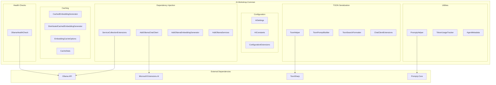
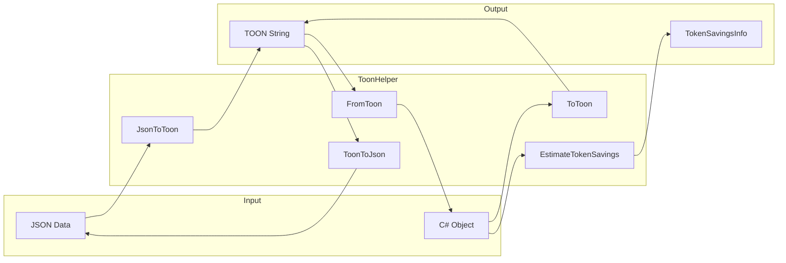
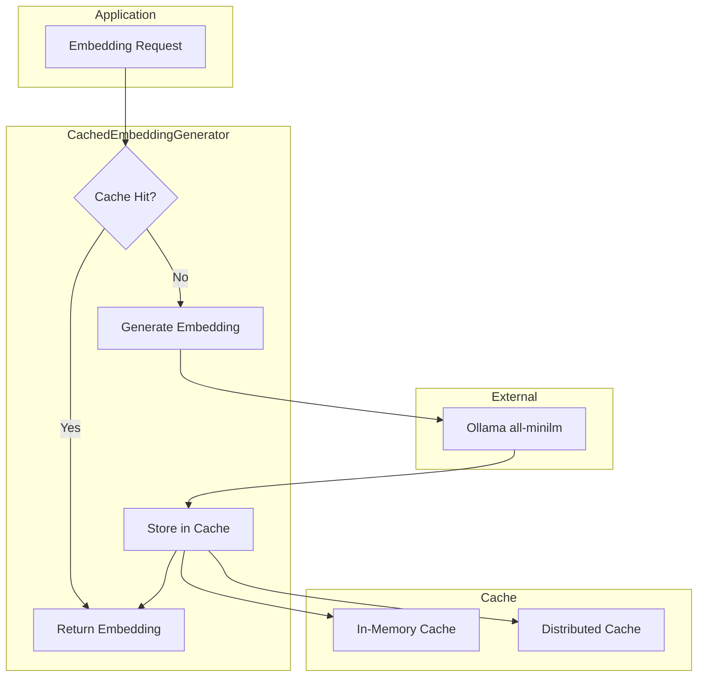
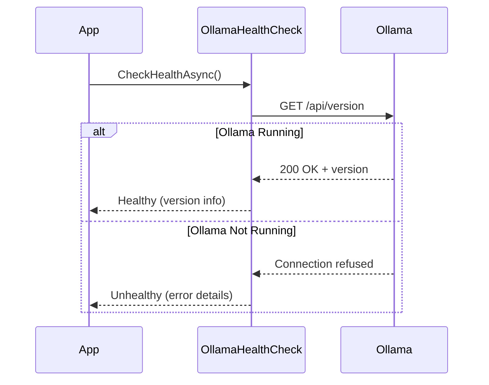

# AI.Workshop.Common

Shared library providing utilities, DI extensions, TOON serialization, embedding caching, and health checks.

## Architecture



## Component Details

### Configuration

| Component | Purpose |
|-----------|---------|
| `AISettings` | POCO for AI configuration (models, endpoints) |
| `AIConstants` | Default values for Ollama URI, models, dimensions |
| `ConfigurationExtensions` | `GetAISettings()` extension for IConfiguration |

### Dependency Injection

| Extension | Registers |
|-----------|-----------|
| `AddOllamaChatClient()` | `IChatClient` singleton |
| `AddOllamaEmbeddingGenerator()` | `IEmbeddingGenerator<string, Embedding<float>>` singleton |
| `AddOllamaServices()` | Both chat and embedding clients |
| `AddOllamaEmbeddingGeneratorWithCaching()` | Embedding generator with in-memory cache |

### TOON (Token-Oriented Object Notation)



**Token Savings Example:**
```
JSON (156 chars):
{"results":[{"filename":"doc.pdf","page":1,"text":"Content..."}]}

TOON (89 chars):
results[1]:
  filename|page|text
  doc.pdf|1|Content...

Savings: ~43%
```

### Embedding Caching



### Health Checks



## Technologies

| Technology | Version | Purpose |
|------------|---------|---------|
| .NET | 10.0 | Runtime |
| Microsoft.Extensions.AI | 10.0.1 | AI abstractions |
| ToonSharp | 1.0.0 | TOON serialization |
| Prompty.Core | 0.2.3 | Prompt templates |
| OllamaSharp | 5.4.11 | Ollama API client |

## Usage

```csharp
// Configuration via DI
builder.Services.AddOllamaServices(builder.Configuration);

// TOON serialization
var toon = ToonHelper.ToToon(myData);
var savings = ToonHelper.EstimateTokenSavings(myData);

// Cached embeddings
var generator = embeddingGenerator.WithCaching(opts => {
    opts.MaxCacheSize = 10000;
});

// Health check
builder.Services.AddHealthChecks()
    .AddCheck<OllamaHealthCheck>("ollama");
```
