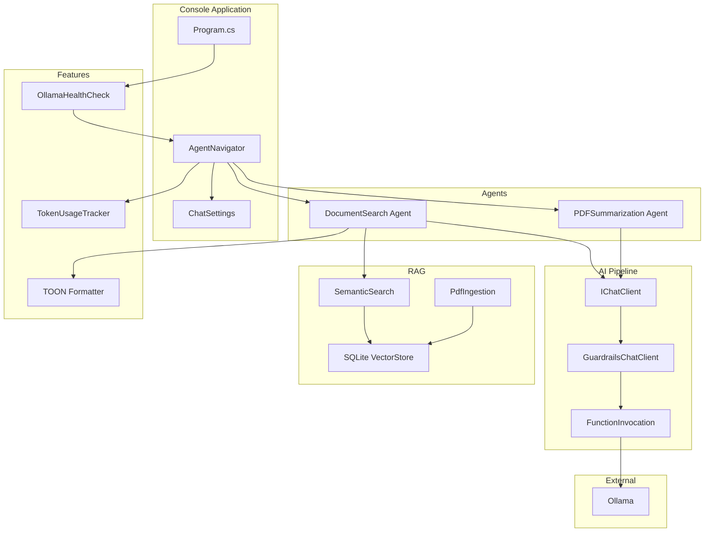
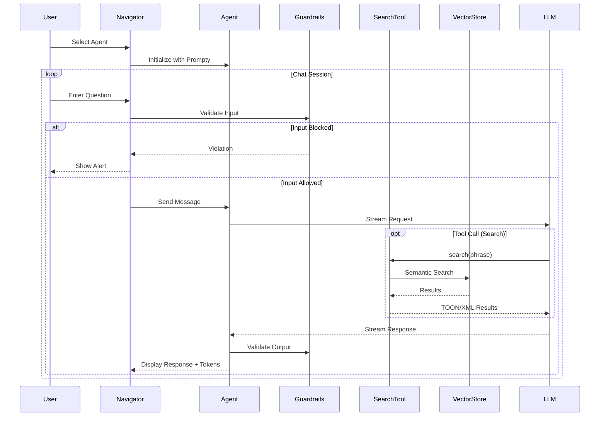
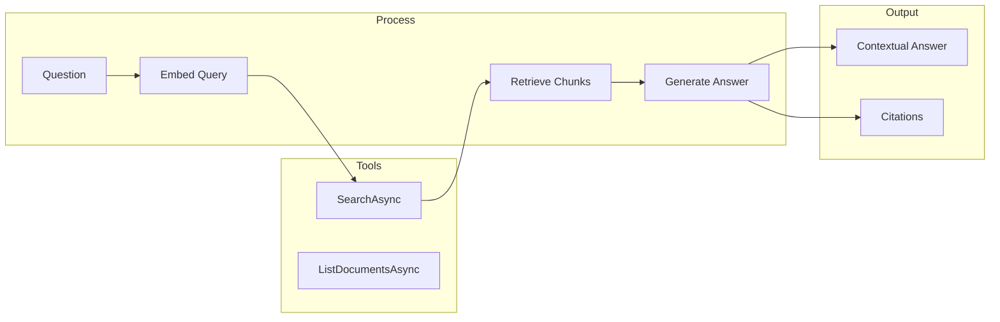
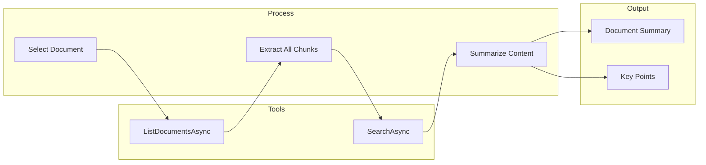
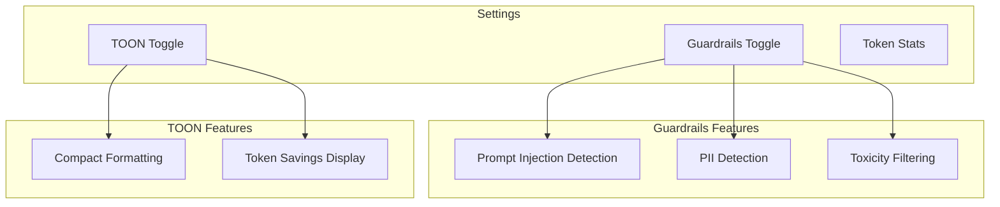
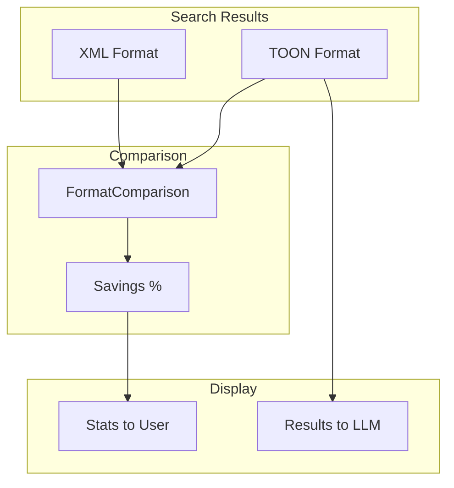

# AI.Workshop.Console.AgentChat

Interactive console application with agent navigation, RAG workflows, guardrails, and TOON support.

## Architecture



## Agent Flow



## Agents

### DocumentSearch Agent



### PDFSummarization Agent



## Settings Menu



**Menu Display:**
```
╔═══════════════════════════════════════════════════╗
║           AI Workshop - Settings Menu             ║
╠═══════════════════════════════════════════════════╣
║  [1] Guardrails: ENABLED - Content safety         ║
║  [2] TOON Format: DISABLED                        ║
║                                                   ║
║  📊 Token stats are always displayed              ║
║  [0] Back to main menu                            ║
╚═══════════════════════════════════════════════════╝
```

## Project Structure

```
AI.Workshop.Console.AgentChat/
├── Program.cs              # Entry point
├── AgentNavigator.cs       # Main navigation and chat loop
├── ChatSettings.cs         # Runtime settings
├── Prompts/
│   ├── DocumentSearch.prompty
│   ├── DocumentSearchSimple.prompty
│   ├── GeneralAssistant.prompty
│   └── PDFSummarization.prompty
└── Data/
    └── *.pdf               # Documents for RAG
```

## TOON Integration



**Example Output:**
```
TOON (89 chars) vs XML (156 chars) - Savings: 43%
```

## Technologies

| Technology | Version | Purpose |
|------------|---------|---------|
| .NET | 10.0 | Runtime |
| Ollama | - | LLM + Embeddings |
| AI.Workshop.Common | - | TOON, caching, health checks |
| AI.Workshop.Guardrails | - | Content safety |
| AI.Workshop.VectorStore | - | RAG pipeline |
| Spectre.Console | - | Interactive UI |

## Usage

```bash
cd AI.Workshop.Console.AgentChat
dotnet run
```

**Commands:**
- Select agent from menu
- Type questions to chat
- Press `[S]` for settings
- Press `[B]` to switch agents
- Press `[Q]` to quit (shows session summary)
