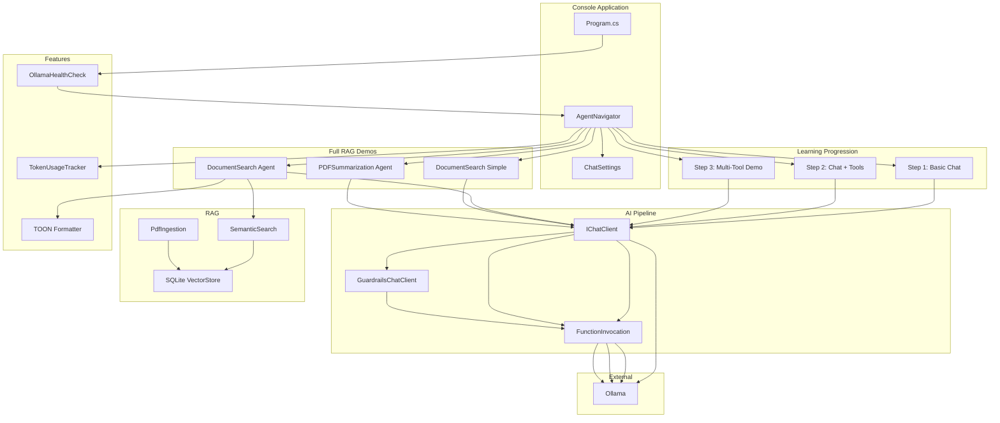
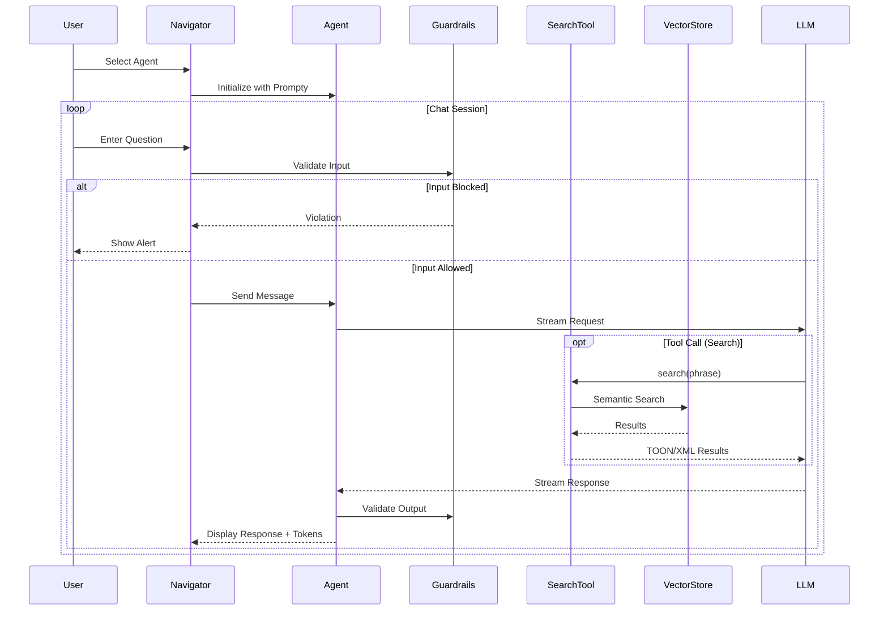
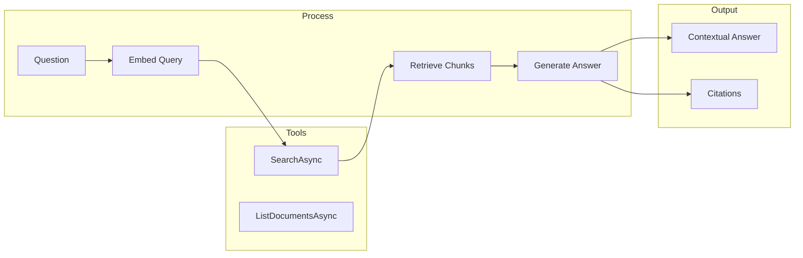
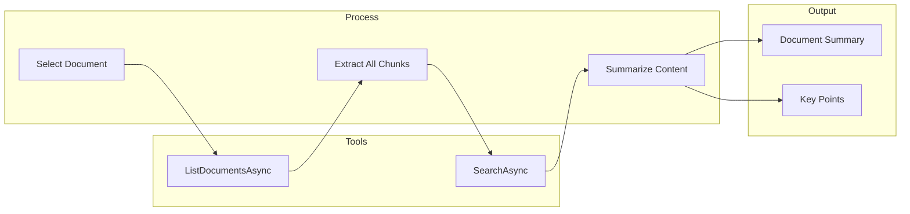
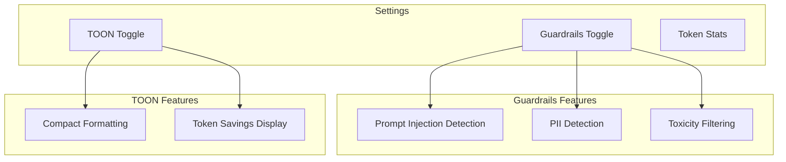
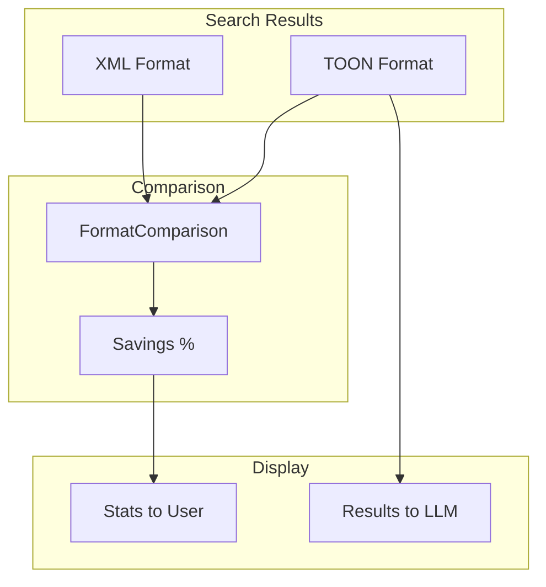

# AI.Workshop.Console.AgentChat

Interactive console application demonstrating **AI agent capabilities** in a learning progression - from basic chat to full RAG. Includes guardrails, TOON support, and token tracking.

## Purpose

This project teaches AI agent patterns step-by-step:
1. **Basic Chat** - LLM interaction with conversation history
2. **Tool Calling** - Function invocation with CurrentTime tool
3. **Multi-Tool Demo** - Stateful shopping cart with multiple tools
4. **Full RAG** - Document search with vector store integration
5. **Prompt Engineering** - Compare different system prompts
6. **Advanced RAG** - PDF summarization with document listing

> **Note:** For vector store backend comparison, see `AI.Workshop.Console.VectorDemos`.

## Architecture



## Agent Flow



## Demo Descriptions

### Step 1: Basic Chat
- Pure LLM interaction with streaming responses
- Conversation history for context retention
- System prompt defines assistant behavior
- **No tools** - foundation for understanding chat mechanics

### Step 2: Chat + Tools
- Introduces `AIFunctionFactory` for tool creation
- LLM decides when to call `CurrentTime` tool
- `UseFunctionInvocation()` middleware
- Tool results integrated into responses

### Step 3: Multi-Tool Demo (Shopping Cart)
- Multiple tools working together (pricing, cart management)
- Stateful tool (Cart class maintains state)
- LLM orchestrates tool calls
- Real-world function calling pattern

---

## Full RAG Agents

### DocumentSearch Agent



### PDFSummarization Agent



## Settings Menu



**Menu Display:**
```
╔════════════════════════════════════════════════════════════════════════╗
║              AI Workshop - Agent Chat Demos                            ║
║                                                                        ║
║  Learn AI agent capabilities from basic chat to full RAG               ║
╠════════════════════════════════════════════════════════════════════════╣
║  🛡️ Guardrails: ON | 📝 TOON: OFF                                      ║
╠════════════════════════════════════════════════════════════════════════╣
║  LEARNING PROGRESSION:                                                 ║
╠════════════════════════════════════════════════════════════════════════╣
║  [1] Step 1: Basic Chat          Simple chat loop with history         ║
║  [2] Step 2: Chat + Tools        Adds CurrentTime tool                 ║
║  [3] Step 3: Multi-Tool Demo     Shopping cart with multiple tools     ║
╠════════════════════════════════════════════════════════════════════════╣
║  FULL RAG IMPLEMENTATIONS:                                             ║
╠════════════════════════════════════════════════════════════════════════╣
║  [4] Document Search             Complete RAG with citations           ║
║  [5] Document Search (Simple)    Simplified prompt variant             ║
║  [6] PDF Summarization           Document summarization                ║
╠════════════════════════════════════════════════════════════════════════╣
║  [S] Settings - Toggle Guardrails, TOON                                ║
║  [0] Exit                                                              ║
╚════════════════════════════════════════════════════════════════════════╝
```

**Settings Menu:**
```
╔═══════════════════════════════════════════════════╗
║           AI Workshop - Settings Menu             ║
╠═══════════════════════════════════════════════════╣
║  [1] Guardrails: ENABLED - Content safety         ║
║  [2] TOON Format: DISABLED                        ║
║                                                   ║
║  📊 Token stats are always displayed              ║
║  [0] Back to main menu                            ║
╚═══════════════════════════════════════════════════╝
```

## Project Structure

```
AI.Workshop.Console.AgentChat/
├── Program.cs              # Entry point with health check
├── AgentNavigator.cs       # Main navigation, demo selection, chat loop
├── ChatSettings.cs         # Runtime settings (Guardrails, TOON)
├── BasicToolsExamples.cs   # Step 3: Shopping cart demo
├── RagWorkflowExamples.cs  # Legacy RAG examples (reference)
├── InMemoryVectorStoreSearch.cs  # Legacy vector search (reference)
├── Tools/
│   └── CurrentTimeTool.cs  # Example tool for Step 2
├── Prompts/
│   ├── GeneralAssistant.prompty   # Steps 1-3
│   ├── DocumentSearch.prompty     # Full RAG
│   ├── DocumentSearchSimple.prompty
│   └── PDFSummarization.prompty
└── Data/
    └── *.pdf               # Documents for RAG demos
```

## TOON Integration



**Example Output:**
```
TOON (89 chars) vs XML (156 chars) - Savings: 43%
```

## Technologies

| Technology | Version | Purpose |
|------------|---------|---------|
| .NET | 10.0 | Runtime |
| Ollama | - | LLM + Embeddings |
| AI.Workshop.Common | - | TOON, caching, health checks |
| AI.Workshop.Guardrails | - | Content safety |
| AI.Workshop.VectorStore | - | RAG pipeline |
| Spectre.Console | - | Interactive UI |

## Usage

```bash
cd AI.Workshop.Console.AgentChat
dotnet run
```

**Commands:**
- Select agent from menu
- Type questions to chat
- Press `[S]` for settings
- Press `[B]` to switch agents
- Press `[Q]` to quit (shows session summary)
