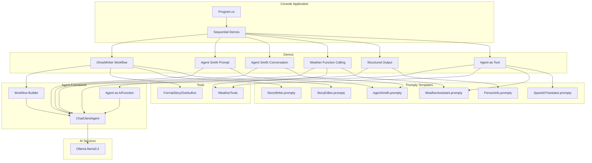
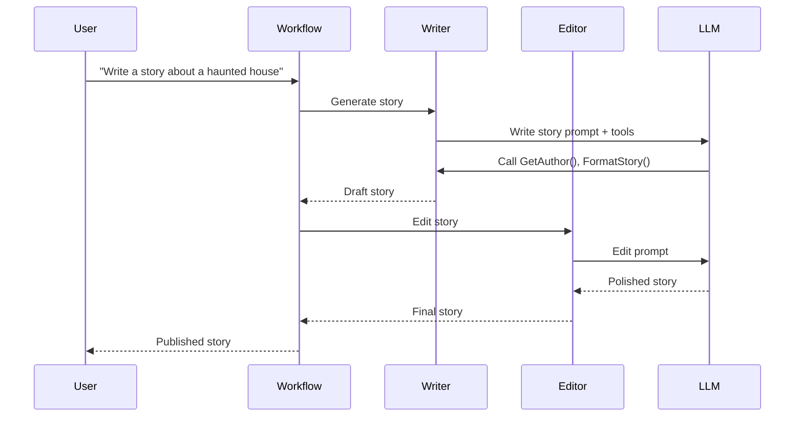
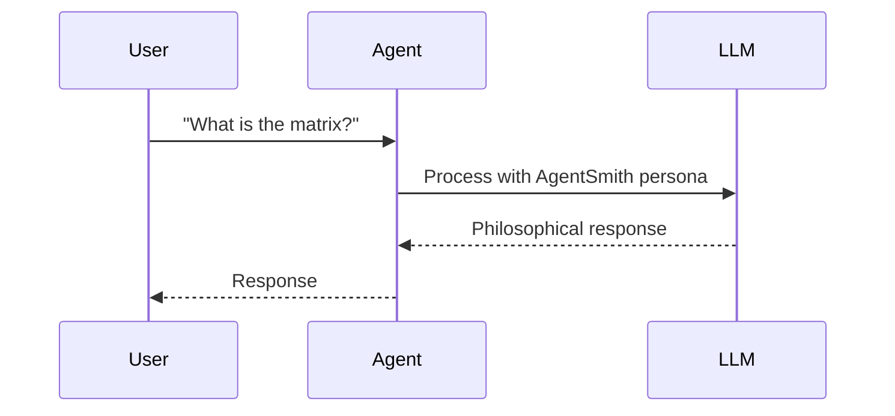
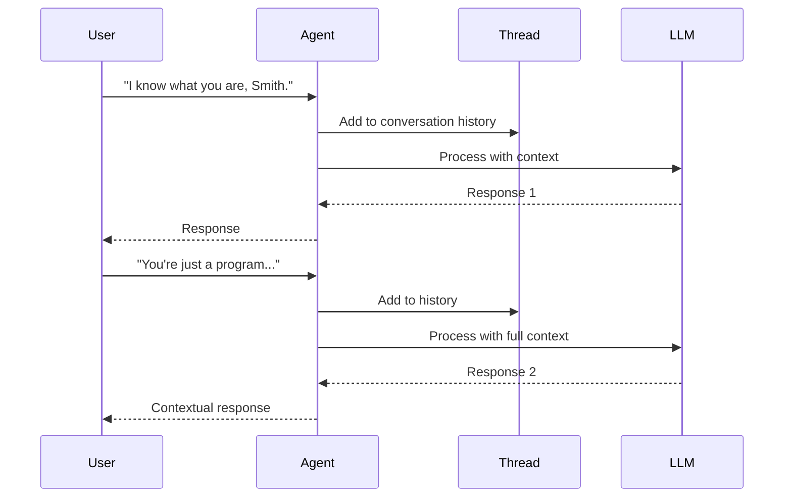
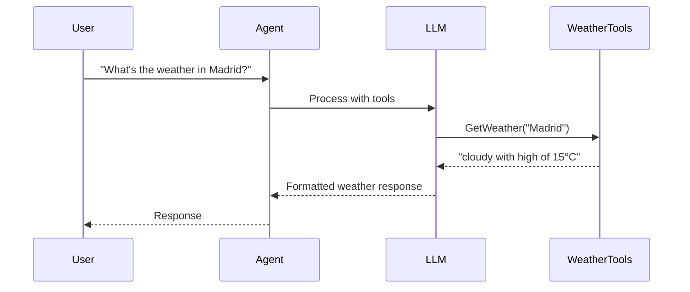
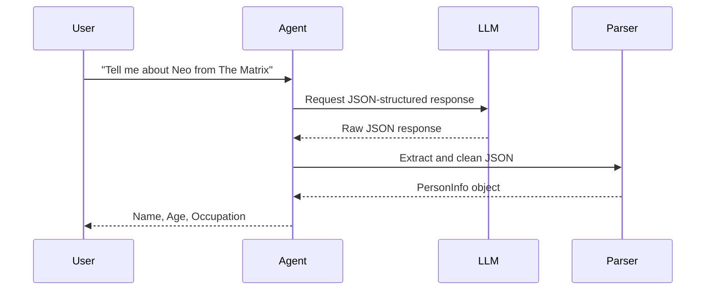
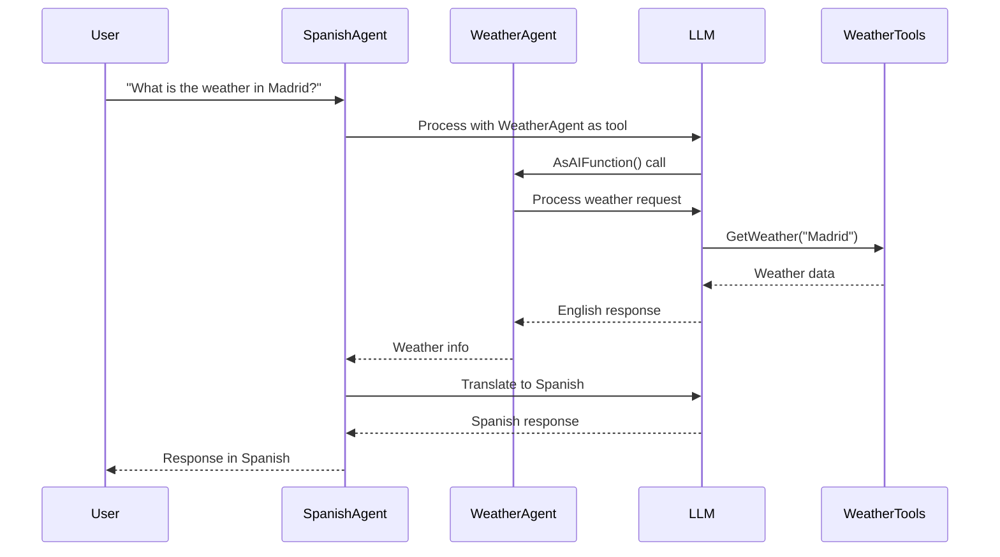
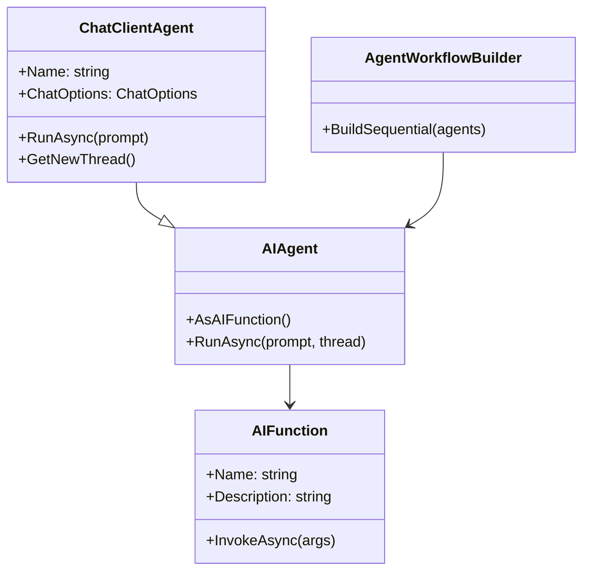

# AI.Workshop.Console.Agents

Console application demonstrating Microsoft Agent Framework capabilities with various agent patterns.

## Architecture



## Agent Patterns

### 1. Sequential Workflow (GhostWriter)



### 2. Single Prompt Agent (Agent Smith)



### 3. Multi-turn Conversation (Agent Smith)



### 4. Tool-Calling Agent (Weather)



### 5. Structured Output (PersonInfo)



### 6. Agent-as-Tool (Spanish Translator + Weather)



## Microsoft Agent Framework



## Demo Descriptions

### 1. GhostWriter Workflow
- **Pattern:** Sequential workflow (AgentWorkflowBuilder)
- **Agents:** Writer → Editor
- **Tools:** `GetAuthor()`, `FormatStory()`
- **Prompts:** StoryWriter.prompty, StoryEditor.prompty
- **Demo:** Two-agent content creation pipeline with tool calling

### 2. Agent Smith Prompt
- **Pattern:** Single prompt
- **Tools:** None
- **Prompt:** AgentSmith.prompty
- **Demo:** Single question/answer with Matrix-themed persona

### 3. Agent Smith Conversation
- **Pattern:** Multi-turn conversation with AgentThread
- **Tools:** None
- **Prompt:** AgentSmith.prompty
- **Demo:** Context-aware conversation using thread history

### 4. Weather Function Calling
- **Pattern:** Tool-calling
- **Tools:** `GetWeather(location)`
- **Prompt:** WeatherAssistant.prompty
- **Demo:** Natural language weather queries with function invocation

### 5. Structured Output (PersonInfo)
- **Pattern:** JSON structured output
- **Tools:** None
- **Prompt:** PersonInfo.prompty
- **Demo:** Parse LLM response into typed PersonInfo object

### 6. Agent-as-Tool (Spanish Translator)
- **Pattern:** Agent composition via AsAIFunction()
- **Tools:** WeatherAgent (as AIFunction)
- **Prompts:** WeatherAssistant.prompty, SpanishTranslator.prompty
- **Demo:** Translator agent uses weather agent as a callable tool

## Project Structure

```
AI.Workshop.Console.Agents/
├── Program.cs                      # Entry point - runs all demos sequentially
├── GhostWriterAgents.cs            # Sequential workflow demo (Writer → Editor)
├── AgentSmithPromptDemo.cs         # Single prompt demo
├── AgentSmithConversationDemo.cs   # Multi-turn conversation demo
├── WeatherFunctionDemo.cs          # Function calling demo
├── StructuredOutputDemo.cs         # JSON structured output parsing
├── AgentAsToolDemo.cs              # Agent-as-tool pattern demo
├── WeatherTools.cs                 # Static weather tool functions
├── PersonInfo.cs                   # PersonInfo model class
├── appsettings.json                # Configuration
└── Prompts/
    ├── AgentSmith.prompty          # Matrix-themed agent persona
    ├── WeatherAssistant.prompty    # Weather agent instructions
    ├── PersonInfo.prompty          # Structured output instructions
    ├── StoryWriter.prompty         # Creative writing agent
    ├── StoryEditor.prompty         # Story editing agent
    └── SpanishTranslator.prompty   # Spanish translation agent
```

## Technologies

| Technology | Version | Purpose |
|------------|---------|---------|
| .NET | 10.0 | Runtime |
| Microsoft.Agents.AI | 0.8.2 | Agent Framework |
| Microsoft.Extensions.AI | 10.0.1 | AI abstractions |
| Ollama | - | LLM backend (llama3.2) |
| Prompty.Core | 0.2.3 | Prompt templates |
| AI.Workshop.Common | - | Shared utilities, health checks |

## Usage

```bash
cd AI.Workshop.Console.Agents
dotnet run
```

**Demo Sequence:**
The application runs all demos sequentially with "Press any key to continue..." between each:

```
=== Ghost Writer Workflow ===
Configuring Ghost Writer workflow (Writer -> Editor)...
Running workflow prompt: Write a short story about a haunted house.
[Story output]

=== Matrix Agents - Single Prompt ===
Prompting Agent Smith with a single question...
Neo: What is the matrix?
Agent Smith: [Response]

=== Matrix Agents - Multi-turn Conversation ===
Continuing the conversation thread with Agent Smith...
[Multi-turn dialogue]

=== Weather Agent - Function Calling ===
Weather agent will call the GetWeather function to answer the user.
User: What's the weather like in Madrid?
Weather Agent: [Response with tool call]

=== PersonInfo Agent - Structured Output ===
Raw response: {"name": "Neo", "age": 33, "occupation": "Hacker"}
Parsed structured output:
Name: Neo, Age: 33, Occupation: Hacker

=== SpanishTranslator Agent - Agent-as-Tool Workflow ===
Using the translator agent to call the weather agent as a tool...
User: What is the weather in Madrid?
Spanish Translator: [Spanish response]
```
