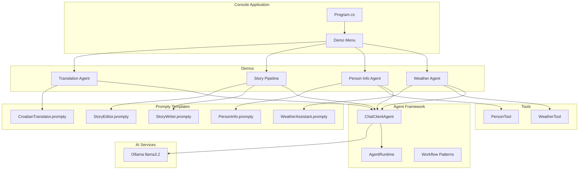
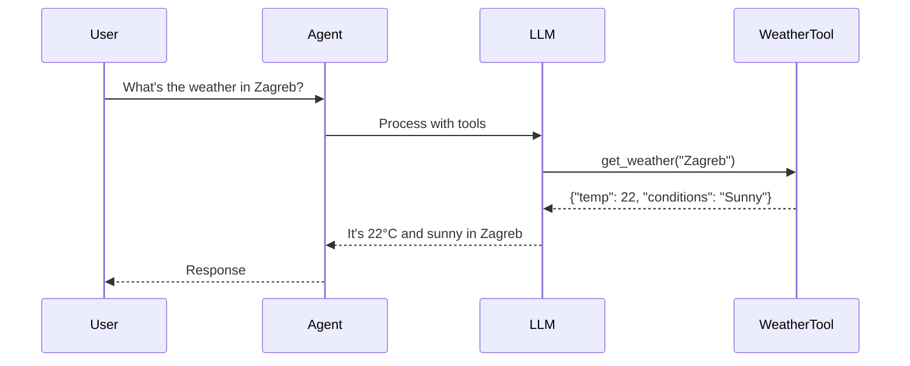
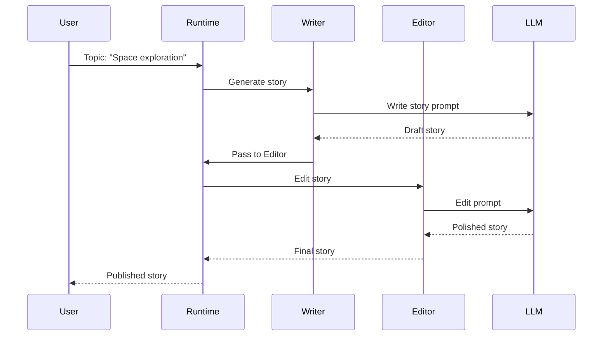
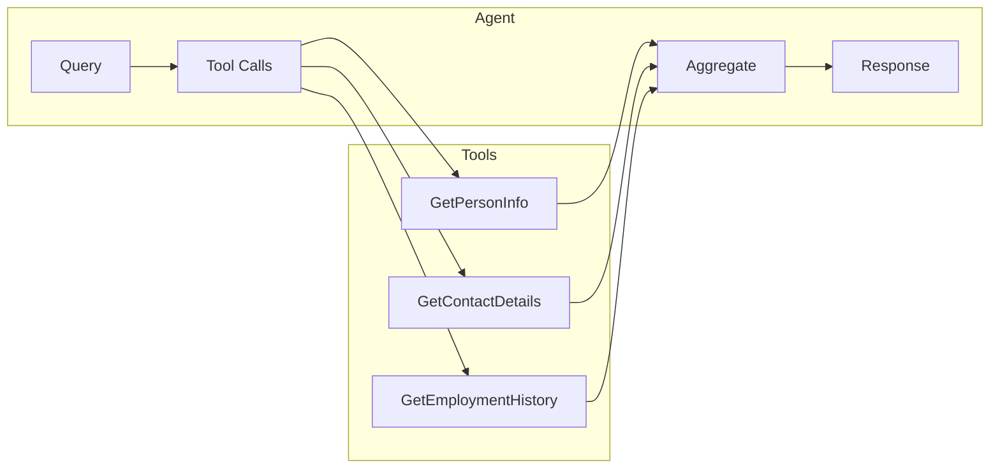
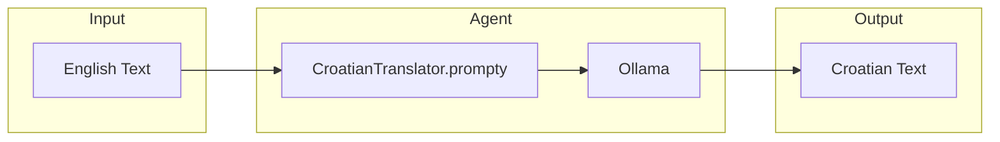
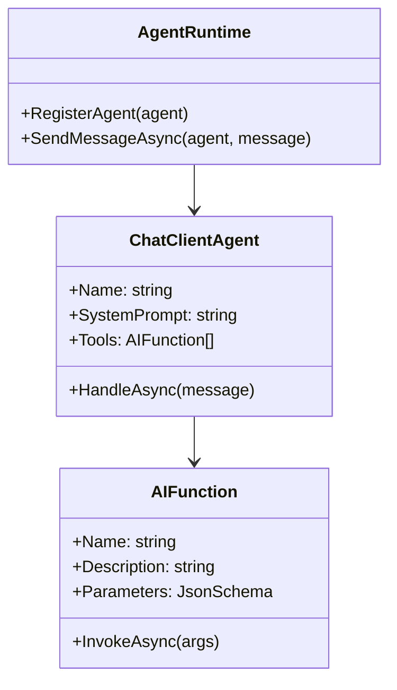

# AI.Workshop.Console.Agents

Console application demonstrating Microsoft Agent Framework capabilities with various agent patterns.

## Architecture



## Agent Patterns

### 1. Tool-Calling Agent (Weather)



### 2. Sequential Pipeline (Story Writer → Editor)



### 3. Multi-Step Agent (Person Info)



### 4. Stateless Translation Agent



## Microsoft Agent Framework



## Demo Descriptions

### Weather Agent
- **Pattern:** Tool-calling
- **Tools:** `get_weather(city)`
- **Prompt:** WeatherAssistant.prompty
- **Demo:** Natural language weather queries

### Person Info Agent
- **Pattern:** Multi-tool orchestration
- **Tools:** `GetPersonInfo`, `GetContactDetails`, `GetEmploymentHistory`
- **Prompt:** PersonInfo.prompty
- **Demo:** Aggregate information from multiple sources

### Story Pipeline
- **Pattern:** Sequential workflow
- **Agents:** Writer → Editor
- **Prompts:** StoryWriter.prompty, StoryEditor.prompty
- **Demo:** Two-agent content creation pipeline

### Translation Agent
- **Pattern:** Stateless transformation
- **Tools:** None
- **Prompt:** CroatianTranslator.prompty
- **Demo:** Direct text translation

## Project Structure

```
AI.Workshop.Console.Agents/
├── Program.cs              # Entry point with menu
├── Demos/
│   ├── WeatherAgentDemo.cs
│   ├── PersonInfoDemo.cs
│   ├── StoryPipelineDemo.cs
│   └── TranslationDemo.cs
├── Tools/
│   ├── WeatherTool.cs
│   └── PersonTool.cs
├── Prompts/
│   ├── WeatherAssistant.prompty
│   ├── PersonInfo.prompty
│   ├── StoryWriter.prompty
│   ├── StoryEditor.prompty
│   └── CroatianTranslator.prompty
└── AgentSmith.prompty      # General agent template
```

## Technologies

| Technology | Version | Purpose |
|------------|---------|---------|
| .NET | 10.0 | Runtime |
| Microsoft.Agents.AI | 0.8.2 | Agent Framework |
| Ollama | - | LLM backend |
| Prompty.Core | 0.2.3 | Prompt templates |
| Spectre.Console | - | Interactive UI |

## Usage

```bash
cd AI.Workshop.Console.Agents
dotnet run
```

**Menu Options:**
```
╔═══════════════════════════════════════════════════╗
║        AI.Workshop - Agent Framework Demos        ║
╠═══════════════════════════════════════════════════╣
║  [1] Weather Agent (Tool Calling)                 ║
║  [2] Person Info Agent (Multi-Tool)               ║
║  [3] Story Pipeline (Writer → Editor)             ║
║  [4] Translation Agent (Croatian)                 ║
║  [0] Exit                                         ║
╚═══════════════════════════════════════════════════╝
```
