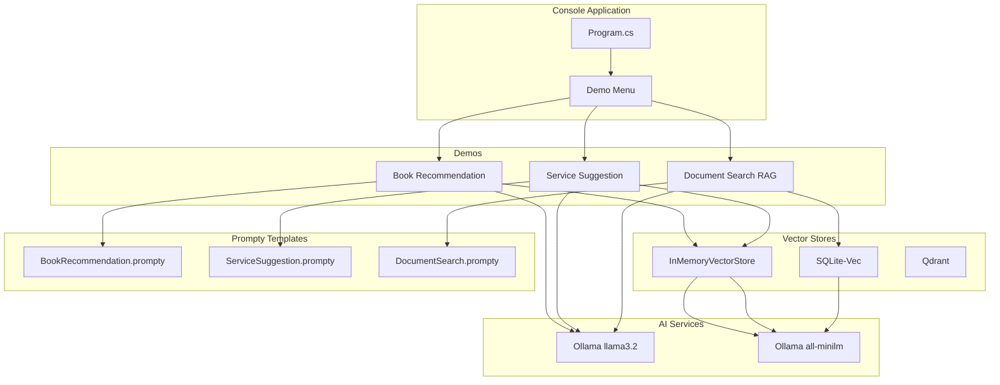
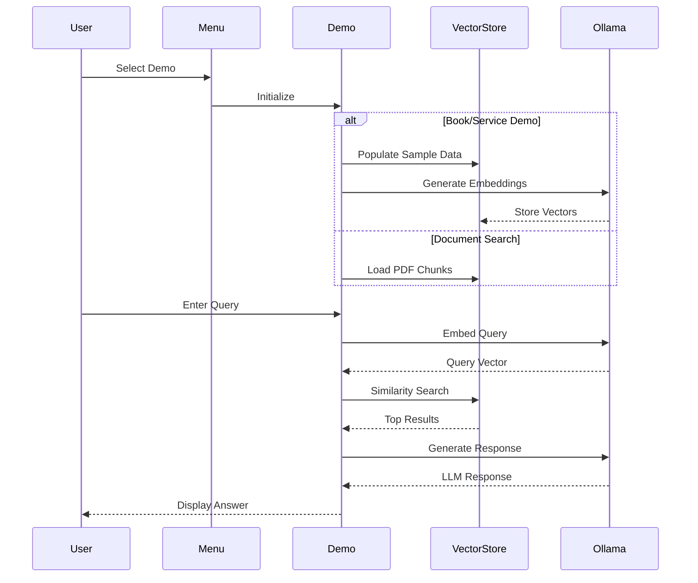
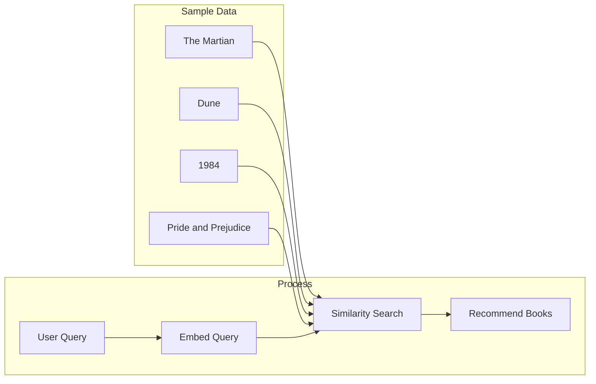
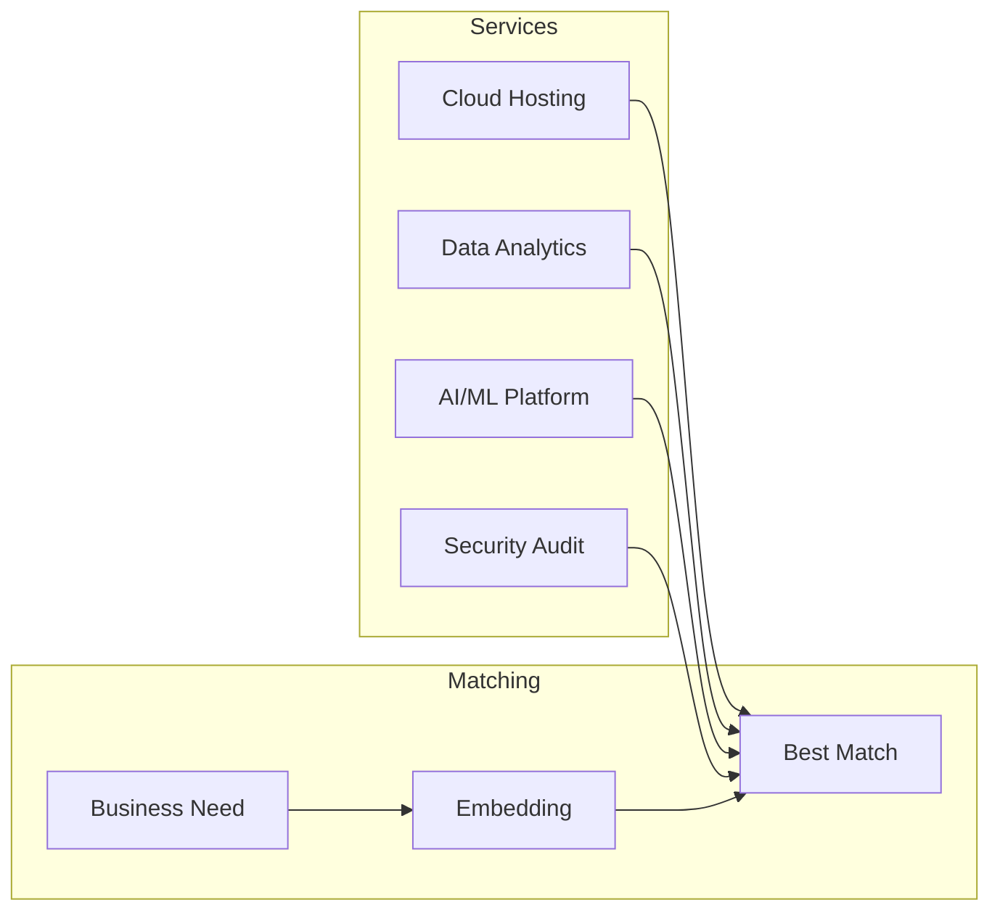
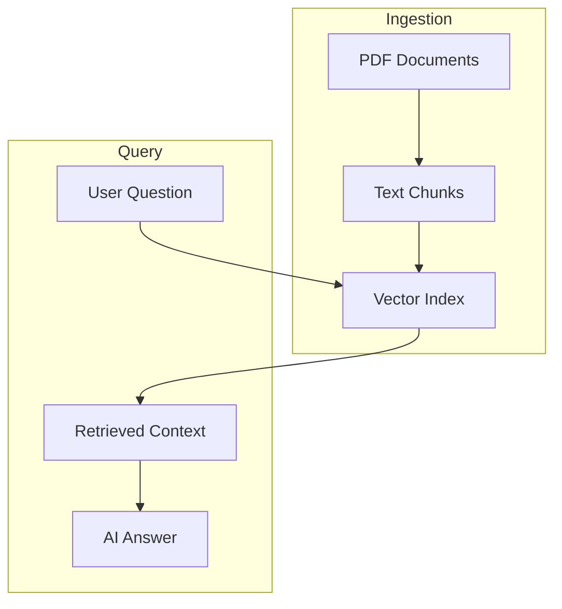

# AI.Workshop.Console.VectorDemos

Console application demonstrating vector store capabilities with SQLite-Vec, Qdrant, and in-memory stores.

## Architecture



## Demo Flow



## Demo Descriptions

### 1. Book Recommendation



### 2. Service Suggestion



### 3. Document Search (RAG)



## Project Structure

```
AI.Workshop.Console.VectorDemos/
├── Program.cs              # Entry point with menu
├── Demos/
│   ├── BookRecommendationDemo.cs
│   ├── ServiceSuggestionDemo.cs
│   └── DocumentSearchDemo.cs
├── Prompts/
│   ├── BookRecommendation.prompty
│   ├── ServiceSuggestion.prompty
│   └── DocumentSearch.prompty
└── Data/
    └── *.pdf               # Sample PDF documents
```

## Technologies

| Technology | Version | Purpose |
|------------|---------|---------|
| .NET | 10.0 | Runtime |
| Ollama | - | LLM (llama3.2) + Embeddings (all-minilm) |
| Microsoft.SemanticKernel.Connectors.InMemory | 1.67.1 | In-memory vector store |
| Microsoft.SemanticKernel.Connectors.Sqlite | 1.67.1 | SQLite vector store |
| Spectre.Console | - | Interactive console UI |

## Usage

```bash
cd AI.Workshop.Console.VectorDemos
dotnet run
```

**Menu Options:**
```
╔═══════════════════════════════════════════════════╗
║          AI.Workshop - Vector Demos               ║
╠═══════════════════════════════════════════════════╣
║  [1] Book Recommendation (In-Memory)              ║
║  [2] Service Suggestion (In-Memory)               ║
║  [3] Document Search (SQLite-Vec RAG)             ║
║  [0] Exit                                         ║
╚═══════════════════════════════════════════════════╝
```
