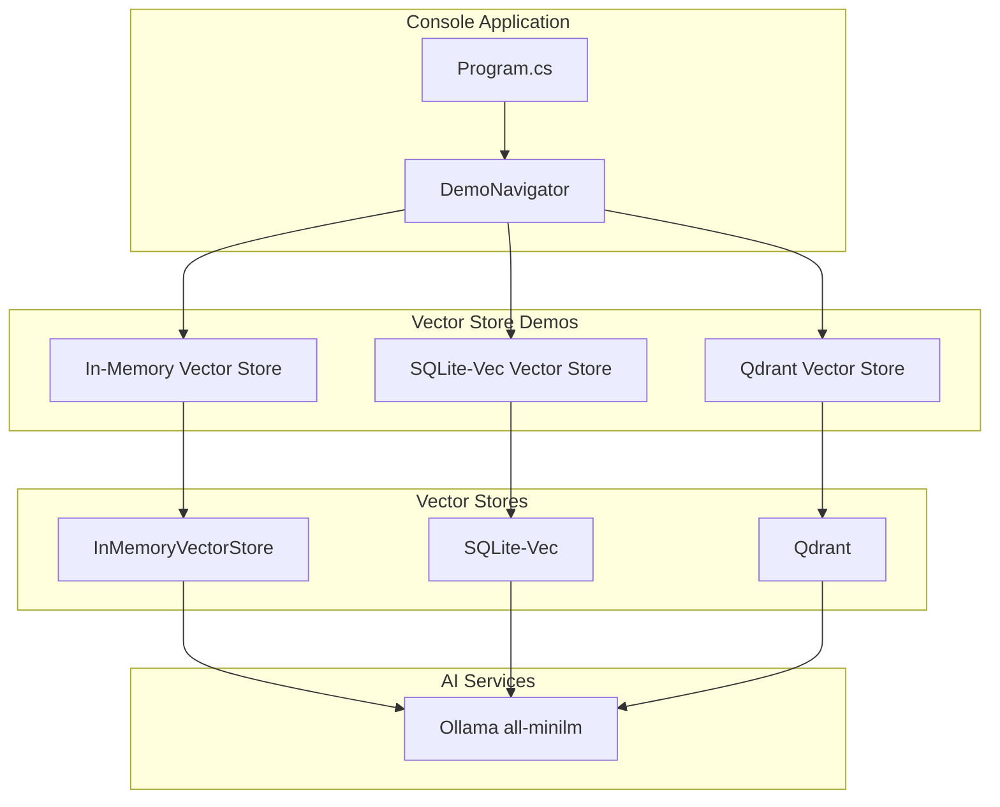
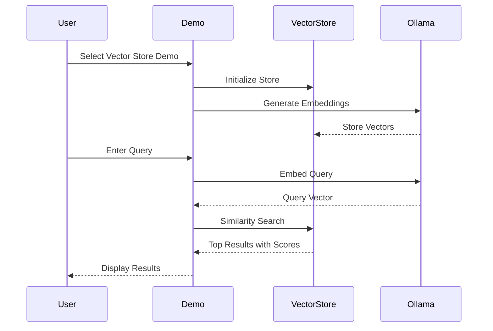

# AI.Workshop.Console.VectorDemos

Interactive console application **comparing vector store backends**. Focuses on storage technologies: In-Memory, SQLite-Vec, and Qdrant.

## Purpose

This project compares different vector store technologies:
1. **In-Memory** - Fast, non-persistent, good for testing
2. **SQLite-Vec** - Embedded persistent storage, single file
3. **Qdrant** - External scalable vector database

> **Note:** For agent patterns (chat, tools, RAG), see `AI.Workshop.Console.AgentChat`.

## Architecture



## Demo Descriptions

### 1. In-Memory Vector Store
- Creates embeddings from sample cloud services data
- Uses `InMemoryVectorStore` from Semantic Kernel
- Performs semantic search with cosine similarity
- Shows raw search results with similarity scores
- **No persistence** - data lost on restart
- **Best for:** Testing, prototyping, small datasets

### 2. SQLite-Vec Vector Store
- PDF document ingestion with chunking
- SQLite-Vec for embedded vector storage
- **Persistent storage** - survives restarts
- Single file database, no external dependencies
- Semantic search with page citations
- **Best for:** Desktop apps, embedded scenarios

### 3. Qdrant Vector Store
- External vector database (requires Docker)
- Production-ready scalable storage
- Supports filtering and metadata queries
- Requires: `docker run -p 6333:6333 -p 6334:6334 qdrant/qdrant`
- **Best for:** Production, large datasets, horizontal scaling

---

## Vector Store Comparison

| Feature | In-Memory | SQLite-Vec | Qdrant |
|---------|-----------|------------|--------|
| Persistence | ❌ | ✅ | ✅ |
| External Dependency | ❌ | ❌ | ✅ Docker |
| Scalability | Low | Medium | High |
| Setup Complexity | None | None | Docker required |
| Best For | Testing | Desktop/Embedded | Production |

## Demo Flow



## Project Structure

```
AI.Workshop.Console.VectorDemos/
├── Program.cs                    # Entry point with health check
├── DemoNavigator.cs              # Interactive demo selection menu
├── BasicLocalOllamaExamples.cs   # In-Memory vector store demo
├── SqlLiteDocumentSearch.cs      # SQLite-Vec demo
├── QdrantDocumentSearch.cs       # Qdrant demo
├── Prompts/
│   ├── BookRecommendation.prompty
│   ├── ServiceSuggestion.prompty
│   └── DocumentSearch.prompty
└── Data/
    └── *.pdf                     # Sample PDF documents
```

## Technologies

| Technology | Version | Purpose |
|------------|---------|---------|
| .NET | 10.0 | Runtime |
| Ollama | - | Embeddings (all-minilm) |
| Microsoft.SemanticKernel.Connectors.InMemory | 1.67.1 | In-memory vector store |
| Microsoft.SemanticKernel.Connectors.Sqlite | 1.67.1 | SQLite vector store |
| Microsoft.SemanticKernel.Connectors.Qdrant | 1.67.1 | Qdrant vector store |

## Usage

```bash
cd AI.Workshop.Console.VectorDemos
dotnet run
```

**Menu Display:**
```
╔════════════════════════════════════════════════════════════════════════╗
║              AI Workshop - Vector Store Demos                          ║
║                                                                        ║
║  Compare different vector store backends                               ║
╠════════════════════════════════════════════════════════════════════════╣
║  [1] In-Memory Vector Store      Fast, non-persistent, good for test...║
║  [2] SQLite-Vec Vector Store     Embedded persistent storage, single...║
║  [3] Qdrant Vector Store         External scalable vector database     ║
║  [0] Exit                                                              ║
╚════════════════════════════════════════════════════════════════════════╝
```

**Each demo shows:**
- Title and description
- Learning points explaining what the demo demonstrates
- Configuration info (models being used)
