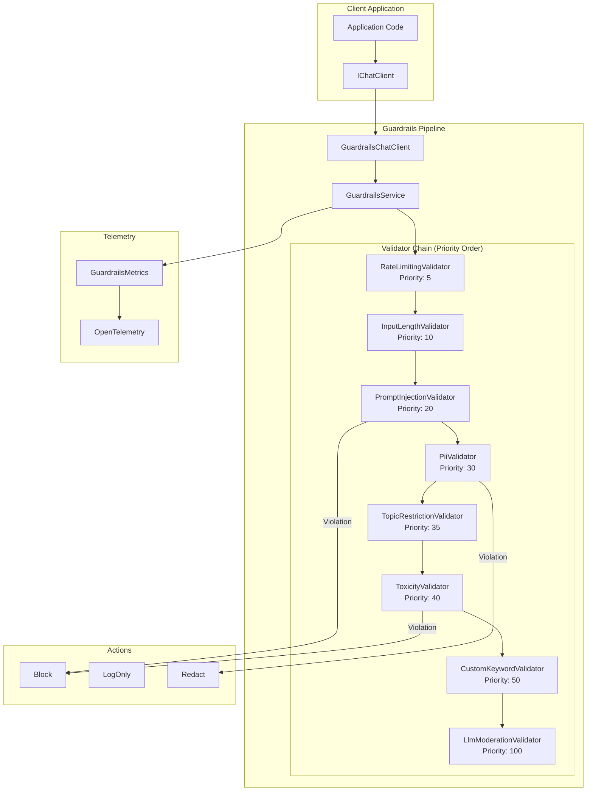
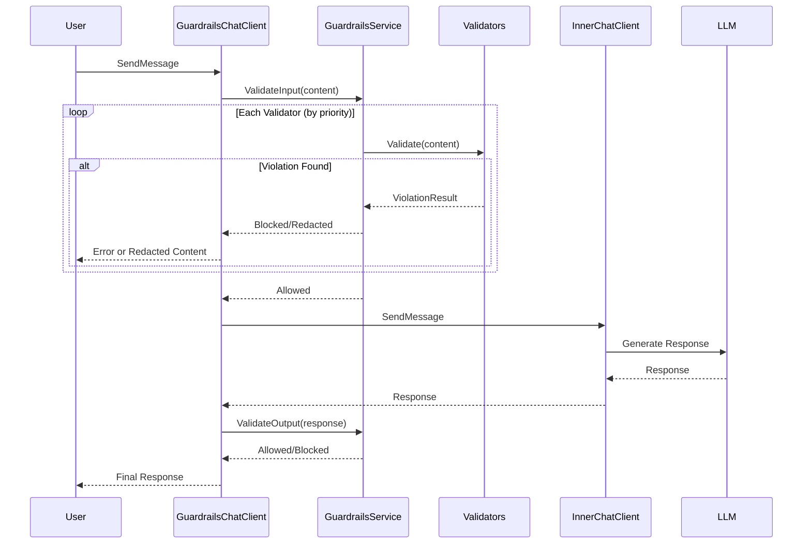
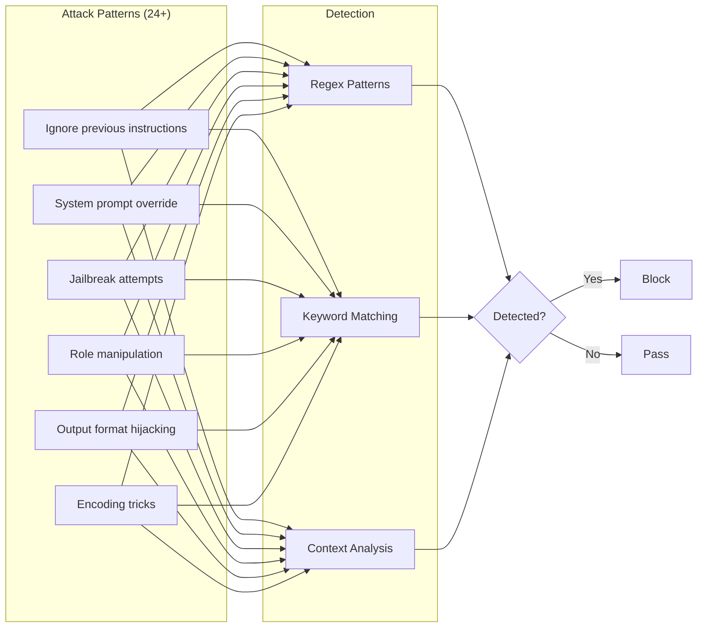
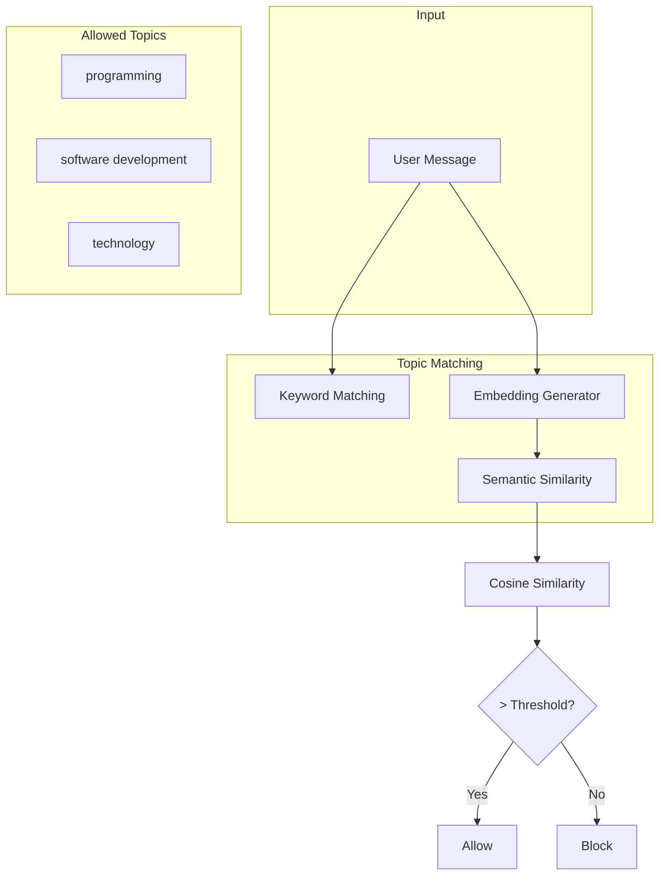
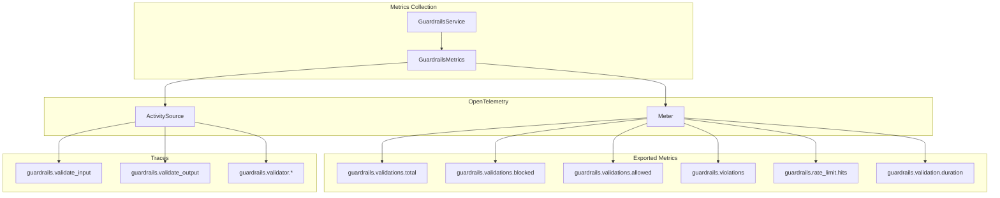
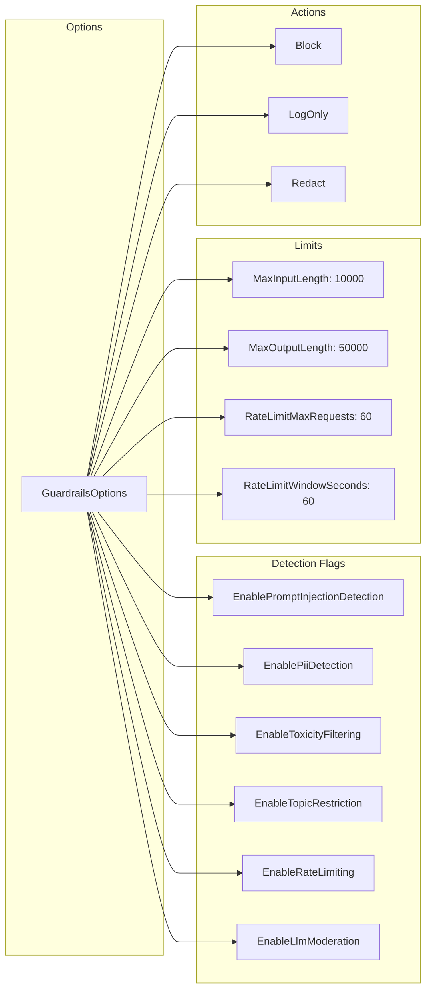

# AI.Workshop.Guardrails

AI safety middleware library providing input/output validation with configurable validators and actions.

## Architecture



## Validator Pipeline



## Validators

### Prompt Injection Detection



### PII Detection

| PII Type | Pattern | Example |
|----------|---------|---------|
| SSN | `\d{3}-\d{2}-\d{4}` | 123-45-6789 |
| Credit Card | `\d{4}[\s-]?\d{4}[\s-]?\d{4}[\s-]?\d{4}` | 4111-1111-1111-1111 |
| Email | Standard email regex | user@example.com |
| Phone | Multiple formats | (555) 123-4567 |
| IP Address | IPv4 pattern | 192.168.1.1 |
| Passport | Common formats | AB1234567 |

### Topic Restriction



## Telemetry



## Configuration



## Technologies

| Technology | Version | Purpose |
|------------|---------|---------|
| .NET | 10.0 | Runtime |
| Microsoft.Extensions.AI | 10.0.1 | ChatClient pipeline |
| System.Diagnostics.DiagnosticSource | - | OpenTelemetry activities |

## Usage

```csharp
// Pipeline integration
IChatClient client = new ChatClientBuilder(ollamaClient)
    .UseGuardrails(options =>
    {
        options.EnablePromptInjectionDetection = true;
        options.EnablePiiDetection = true;
        options.DefaultAction = GuardrailAction.Block;
    })
    .Build();

// DI registration
builder.Services.AddGuardrails(options =>
{
    options.EnableToxicityFiltering = true;
    options.BlockedKeywords = ["confidential"];
});

// Access metrics
var metrics = services.GetService<GuardrailsMetrics>();
var summary = metrics.GetSummary();
Console.WriteLine($"Block rate: {summary.BlockRate:F1}%");
```
