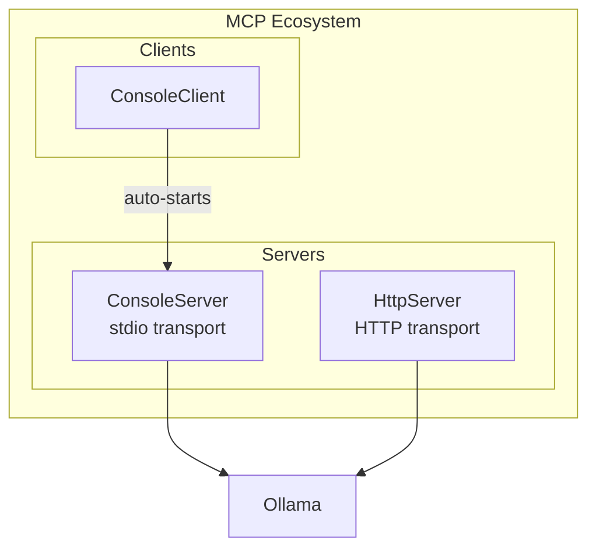
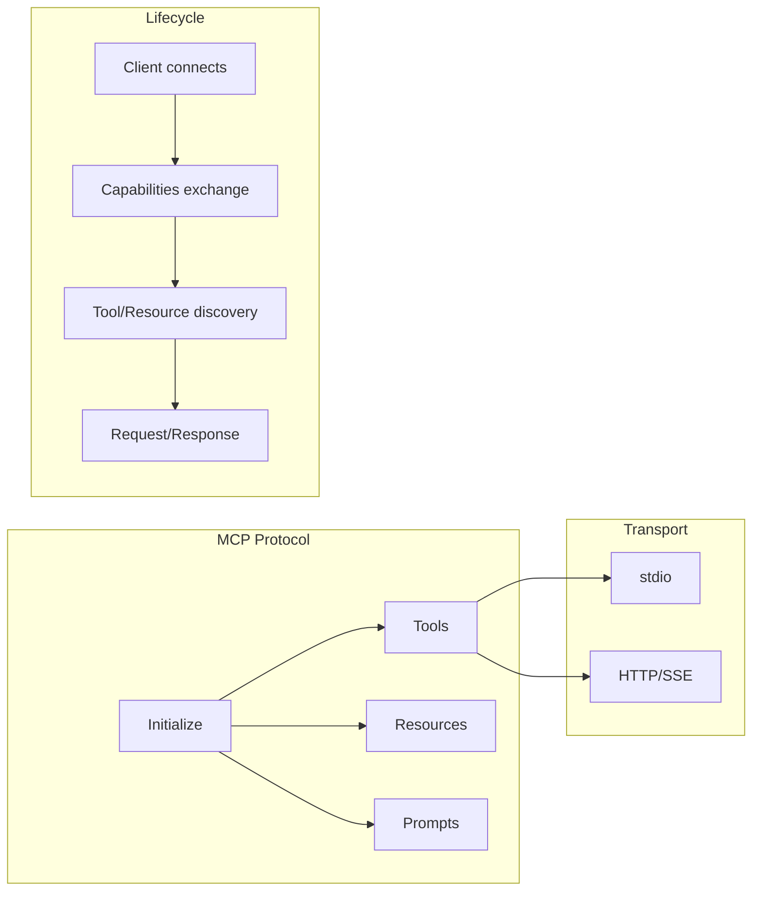
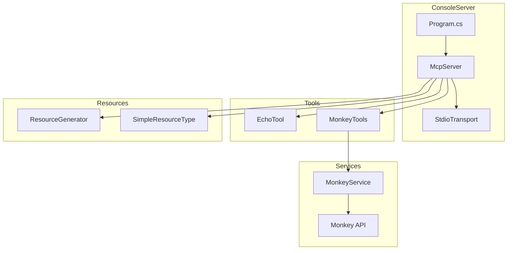
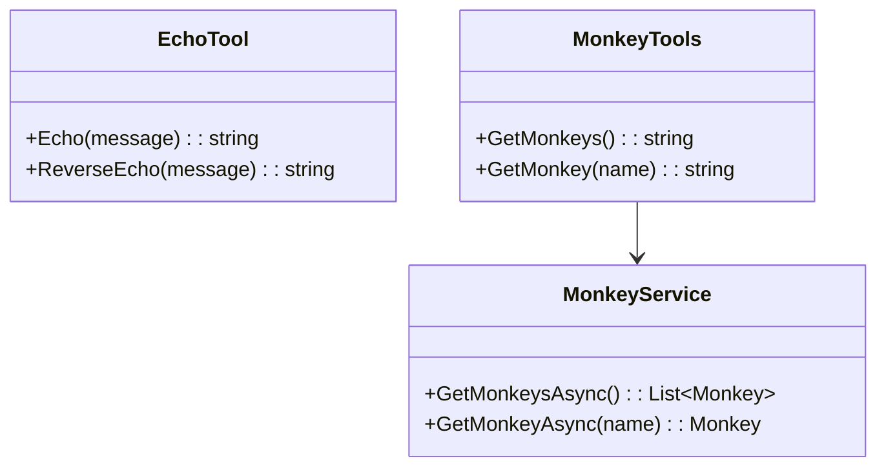
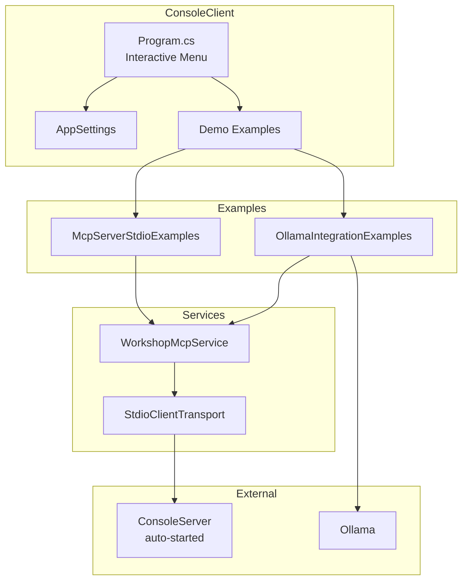
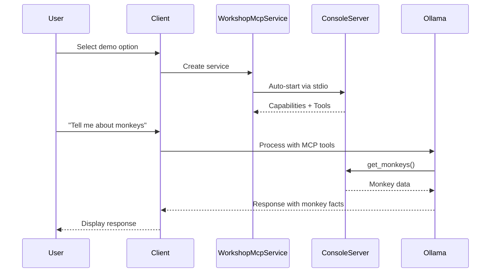
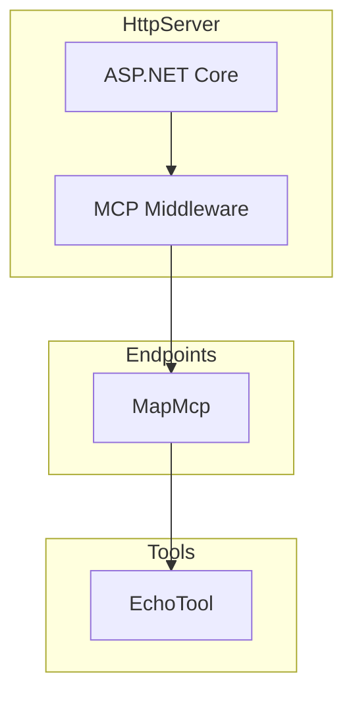

# AI.Workshop.MCP

Model Context Protocol (MCP) implementations including server and client projects.

## Overview



## MCP Architecture



---

## AI.Workshop.MCP.ConsoleServer

MCP server with stdio transport, providing tools and resources.

### Architecture



### Tool Definitions



### Project Structure

```
MCP/AI.Workshop.MCP.ConsoleServer/
├── Program.cs              # Server entry point with MCP configuration
├── MonkeyService.cs        # Service for monkey data
├── Tools/
│   ├── EchoTool.cs         # Echo and reverse echo tools
│   └── MonkeyTools.cs      # Monkey query tools
└── Resources/
    ├── ResourceGenerator.cs
    └── SimpleResourceType.cs
```

---

## AI.Workshop.MCP.ConsoleClient

MCP client with interactive demo menu that auto-starts the MCP server.

### Architecture



### Client Flow



### Project Structure

```
MCP/AI.Workshop.MCP.ConsoleClient/
├── Program.cs                    # Interactive menu entry point
├── AppSettings.cs                # Configuration classes
├── appsettings.json              # Ollama and server settings
├── WorkshopMcpService.cs         # MCP client wrapper (auto-starts server)
├── McpServerStdioExamples.cs     # Server capability demos
├── OllamaIntegrationExamples.cs  # RAG with MCP tools demo
└── Prompts/
    └── MonkeyAssistant.prompty   # System prompt for monkey assistant
```

### Configuration (appsettings.json)

```json
{
  "Ollama": {
    "Uri": "http://localhost:11434/",
    "ChatModel": "llama3.2"
  },
  "McpServer": {
    "ServerProject": "AI.Workshop.MCP.ConsoleServer",
    "ServerDll": "AI.Workshop.MCP.ConsoleServer.dll"
  }
}
```

---

## AI.Workshop.MCP.HttpServer

Minimal MCP server using HTTP transport with ASP.NET Core.

### Architecture



### Project Structure

```
MCP/AI.Workshop.MCP.HttpServer/
├── Program.cs              # Minimal API with MCP and EchoTool
├── appsettings.json
└── Properties/
    └── launchSettings.json
```

---

## Technologies

| Technology | Version | Purpose |
|------------|---------|---------|
| .NET | 10.0 | Runtime |
| ModelContextProtocol | 0.4.1-preview.1 | MCP SDK |
| OllamaSharp | 5.4.11 | Ollama client |
| Microsoft.Extensions.AI | 10.0.1 | AI abstractions |
| ASP.NET Core | 10.0 | HTTP server (HttpServer only) |

## Usage

### Run Console Client (Recommended)

The client automatically starts the MCP server via stdio transport:

```bash
cd MCP/AI.Workshop.MCP.ConsoleClient
dotnet run
```

**Interactive Menu:**
```
╔════════════════════════════════════════════════════════╗
║           MCP Console Client - Demo Menu               ║
╠════════════════════════════════════════════════════════╣
║  1. List Server Info (capabilities, tools, prompts)    ║
║  2. Call MCP Server Tools (echo, reverse_echo)         ║
║  3. Call Monkey Tools (get_monkeys, get_monkey)        ║
║  4. RAG with MCP Tools (requires Ollama)               ║
║  0. Exit                                               ║
╚════════════════════════════════════════════════════════╝
```

### Start HTTP Server

```bash
cd MCP/AI.Workshop.MCP.HttpServer
dotnet run
# Server available at http://localhost:3001
```

## Demo Descriptions

| Demo | Description | Requirements |
|------|-------------|--------------|
| List Server Info | Shows server capabilities, tools, prompts, and resources | None |
| Call MCP Server Tools | Invokes echo and reverse_echo tools | None |
| Call Monkey Tools | Invokes get_monkeys and get_monkey tools | None |
| RAG with MCP Tools | Interactive chat using Ollama with MCP tools | Ollama running locally |
