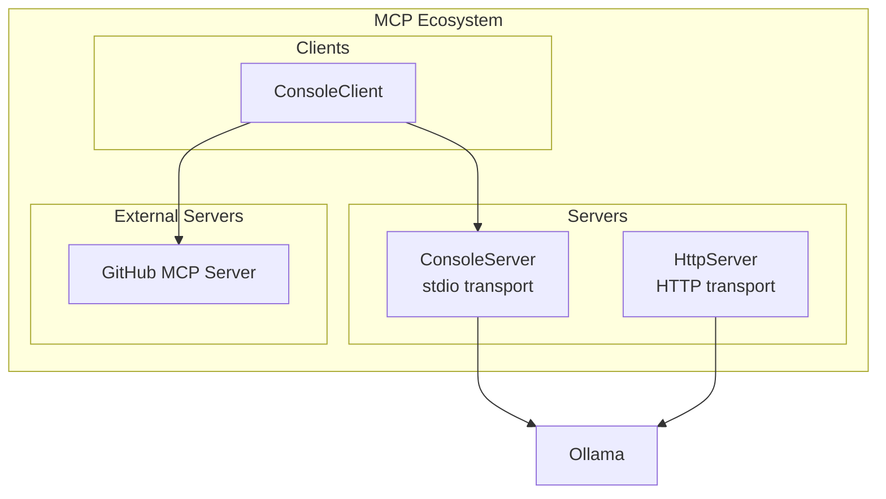
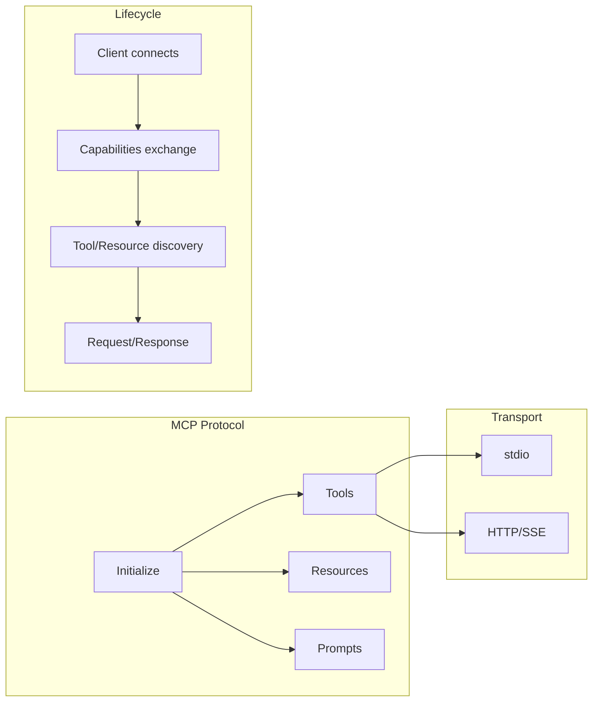
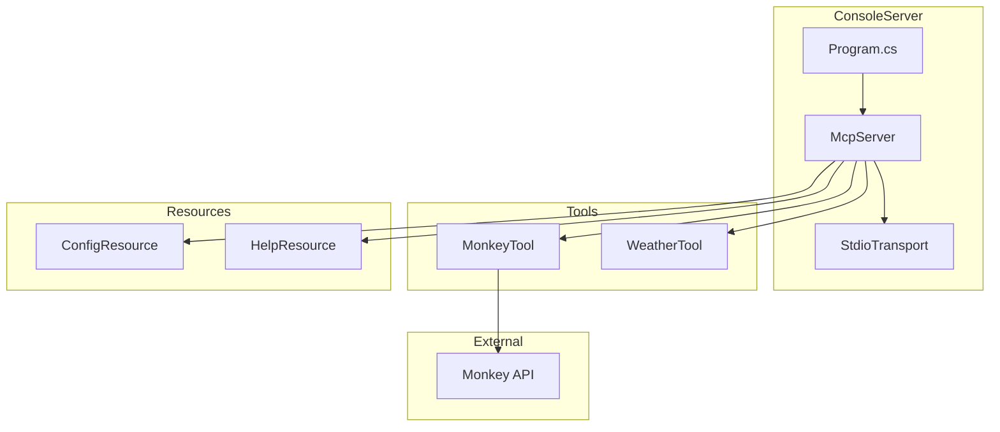
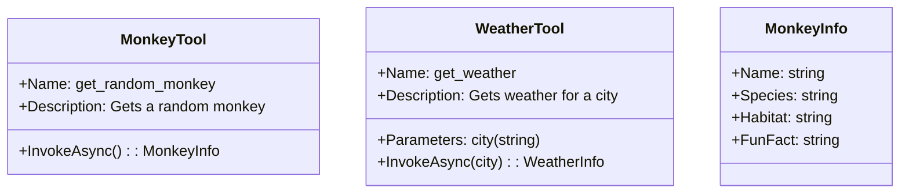
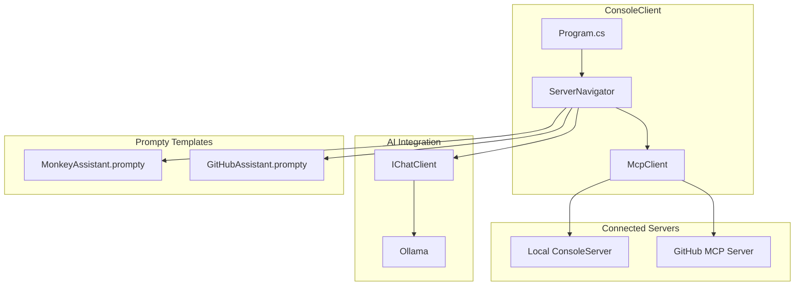
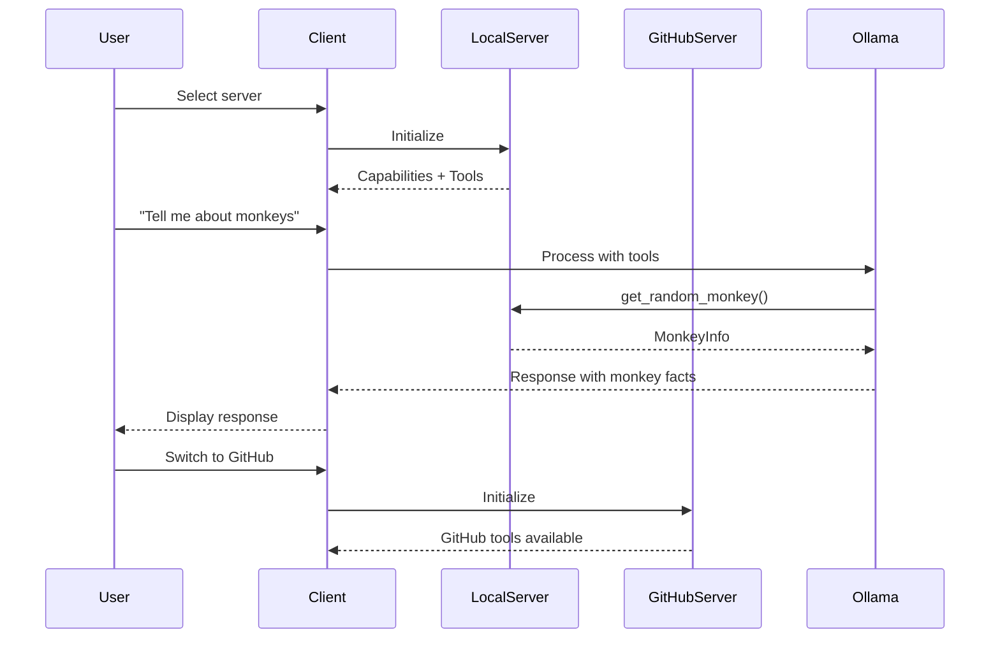
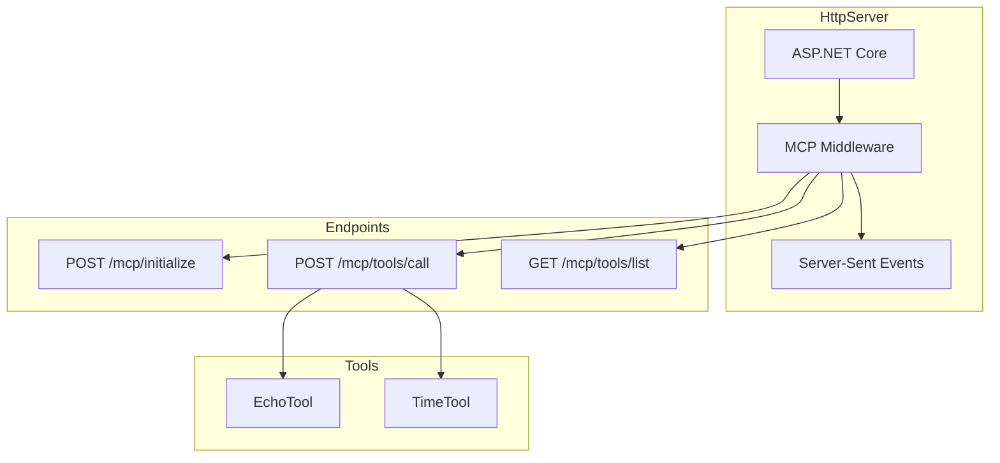

# AI.Workshop.MCP

Model Context Protocol (MCP) implementations including server and client projects.

## Overview



## MCP Architecture



---

## AI.Workshop.MCP.ConsoleServer

MCP server with stdio transport, providing tools and resources.

### Architecture



### Tool Definitions



### Project Structure

```
MCP/AI.Workshop.MCP.ConsoleServer/
├── Program.cs              # Server entry point
├── Tools/
│   ├── MonkeyTool.cs
│   └── WeatherTool.cs
├── Resources/
│   ├── ConfigResource.cs
│   └── HelpResource.cs
└── appsettings.json
```

---

## AI.Workshop.MCP.ConsoleClient

MCP client that connects to local and external MCP servers.

### Architecture



### Client Flow



### Project Structure

```
MCP/AI.Workshop.MCP.ConsoleClient/
├── Program.cs              # Client entry point
├── ServerNavigator.cs      # Server selection UI
├── Prompts/
│   ├── MonkeyAssistant.prompty
│   └── GitHubAssistant.prompty
└── appsettings.json
```

---

## AI.Workshop.MCP.HttpServer

Minimal MCP server using HTTP transport with ASP.NET Core.

### Architecture



### HTTP Endpoints

| Endpoint | Method | Description |
|----------|--------|-------------|
| `/mcp/initialize` | POST | Initialize MCP session |
| `/mcp/tools/list` | GET | List available tools |
| `/mcp/tools/call` | POST | Invoke a tool |
| `/mcp/resources/list` | GET | List resources |
| `/mcp/resources/read` | POST | Read a resource |

### Project Structure

```
MCP/AI.Workshop.MCP.HttpServer/
├── Program.cs              # Minimal API entry
├── McpEndpoints.cs         # Endpoint definitions
├── Tools/
│   ├── EchoTool.cs
│   └── TimeTool.cs
└── appsettings.json
```

---

## Technologies

| Technology | Version | Purpose |
|------------|---------|---------|
| .NET | 10.0 | Runtime |
| ModelContextProtocol | 0.4.1 | MCP SDK |
| ASP.NET Core | 10.0 | HTTP server (HttpServer only) |
| Ollama | - | LLM backend (Client) |
| Spectre.Console | - | Interactive UI (Client) |

## Usage

### Start Console Server

```bash
cd MCP/AI.Workshop.MCP.ConsoleServer
dotnet run
```

### Start HTTP Server

```bash
cd MCP/AI.Workshop.MCP.HttpServer
dotnet run
# Server available at http://localhost:5000
```

### Run Client

```bash
cd MCP/AI.Workshop.MCP.ConsoleClient
dotnet run
```

**Client Menu:**
```
╔═══════════════════════════════════════════════════╗
║            MCP Client - Server Selection          ║
╠═══════════════════════════════════════════════════╣
║  [1] Local Monkey Server (stdio)                  ║
║  [2] GitHub MCP Server (external)                 ║
║  [0] Exit                                         ║
╚═══════════════════════════════════════════════════╝
```

## MCP Configuration (.mcp.json)

```json
{
  "mcpServers": {
    "local-monkey": {
      "command": "dotnet",
      "args": ["run", "--project", "MCP/AI.Workshop.MCP.ConsoleServer"]
    },
    "github": {
      "command": "npx",
      "args": ["-y", "@modelcontextprotocol/server-github"]
    }
  }
}
```
