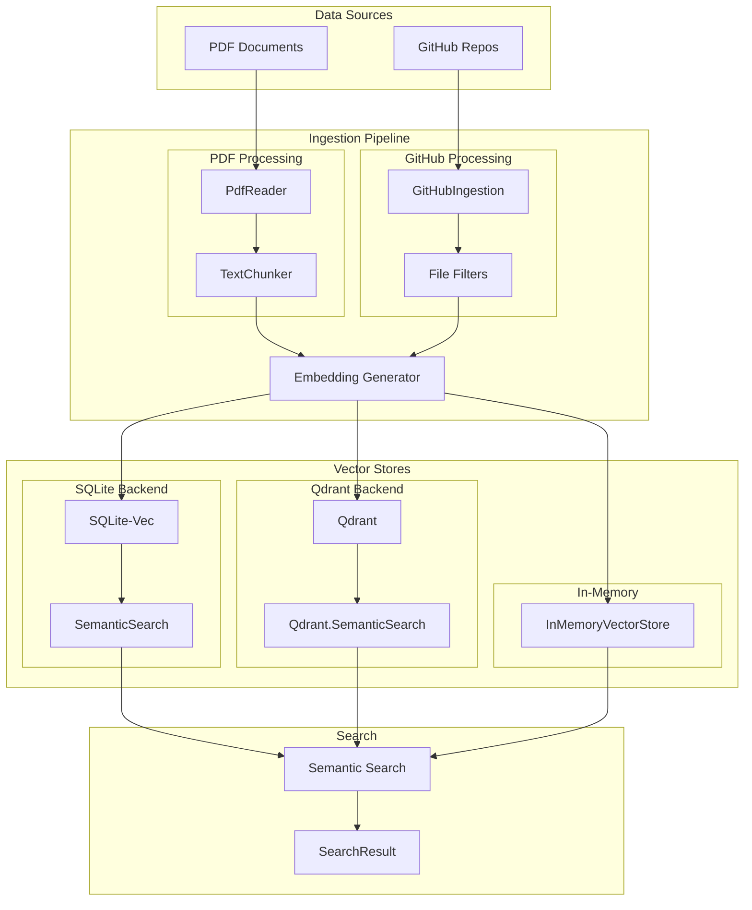
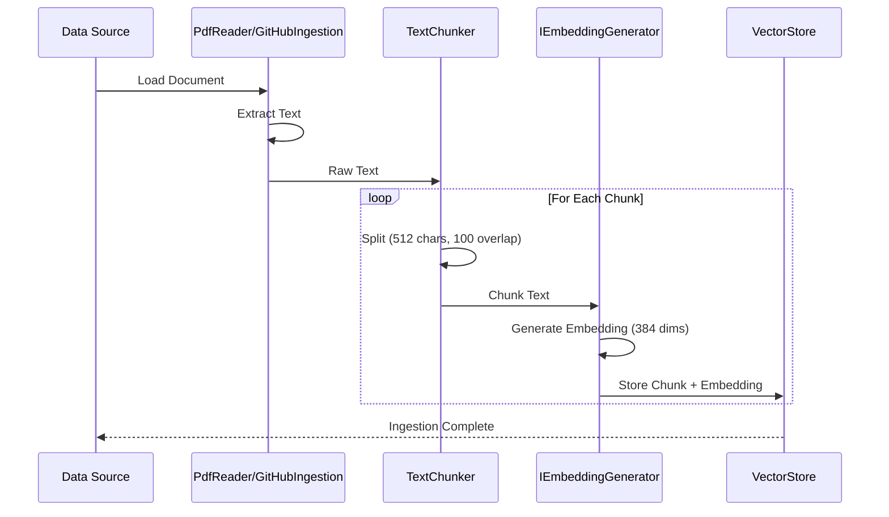
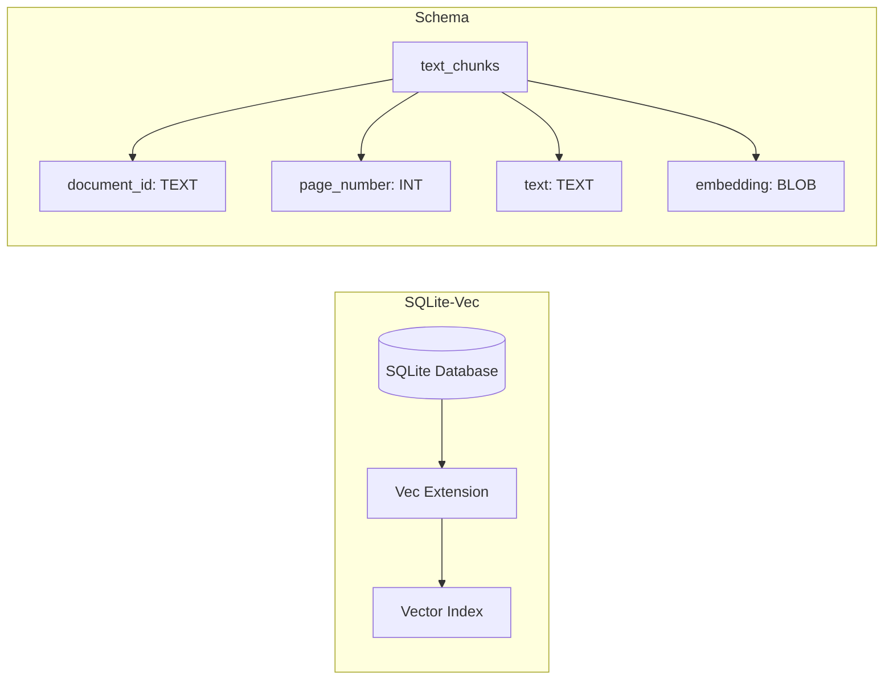
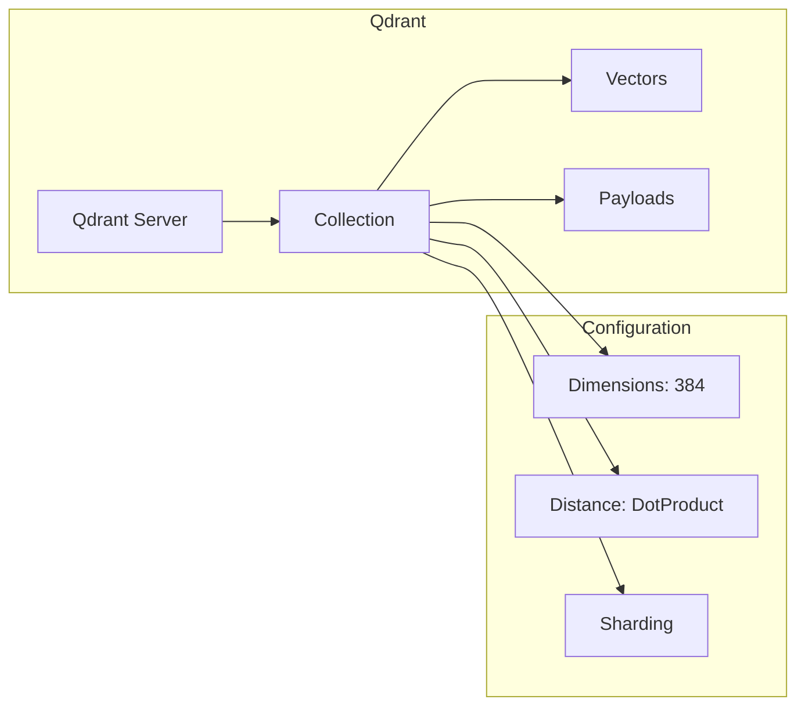
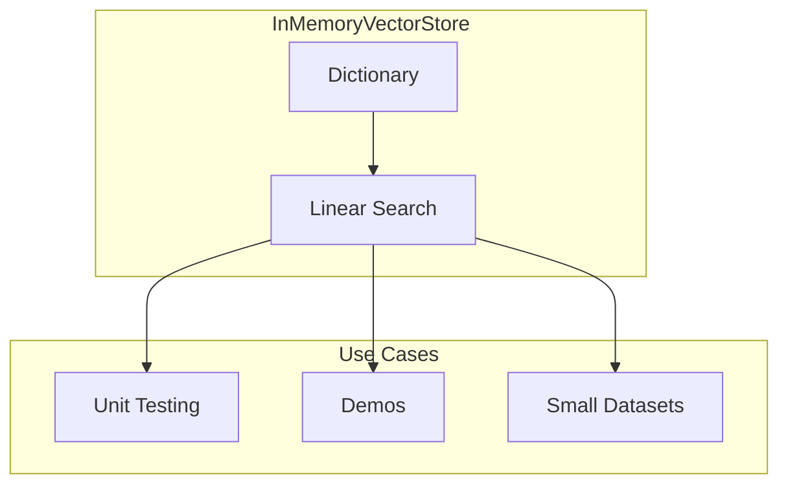
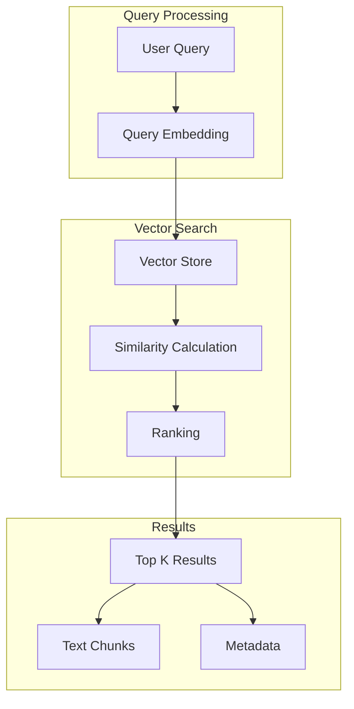
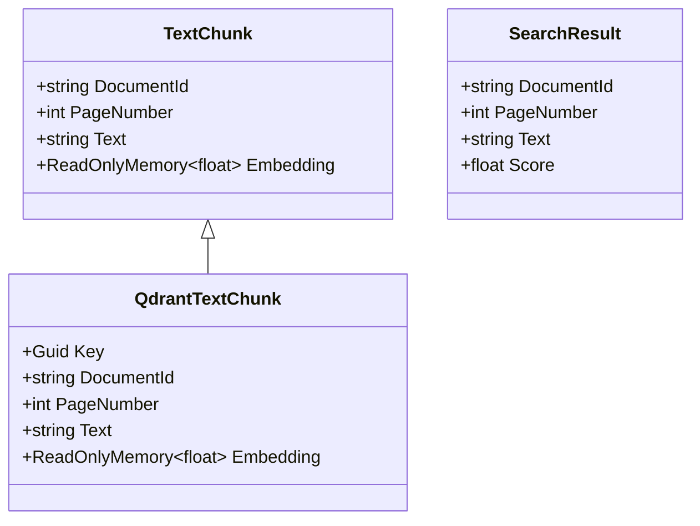
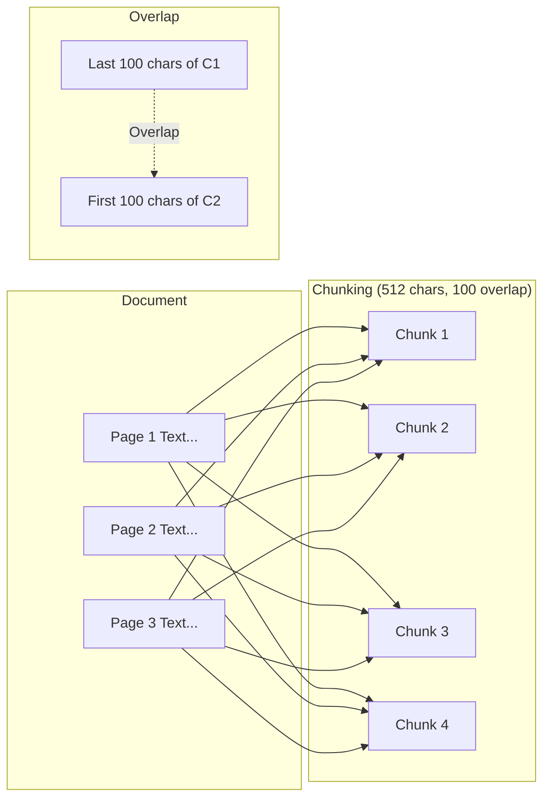

# AI.Workshop.VectorStore

Vector database integrations and RAG (Retrieval-Augmented Generation) pipelines for PDF and GitHub ingestion.

## Architecture



## Ingestion Flow



## Vector Store Implementations

### SQLite-Vec (Default)



**Key Type:** `string`  
**Distance Function:** Cosine Distance

### Qdrant



**Key Type:** `Guid`  
**Distance Function:** Dot Product Similarity

### In-Memory



## Semantic Search



### Search Options

| Parameter | Default | Description |
|-----------|---------|-------------|
| `searchPhrase` | required | Query text to embed and search |
| `filenameFilter` | null | Optional document filter |
| `topK` | 5 | Number of results to return |

## Data Models



## Chunking Strategy



**Configuration:**
- Chunk Size: 512 characters
- Overlap: 100 characters
- Embedding Model: all-minilm (384 dimensions)

## Technologies

| Technology | Version | Purpose |
|------------|---------|---------|
| .NET | 10.0 | Runtime |
| Microsoft.SemanticKernel.Connectors.Sqlite | 1.67.1 | SQLite vector store |
| Microsoft.SemanticKernel.Connectors.Qdrant | 1.67.1 | Qdrant vector store |
| Microsoft.SemanticKernel.Connectors.InMemory | 1.67.1 | In-memory store |
| PdfPig | 0.1.9 | PDF text extraction |

## Usage

```csharp
// SQLite ingestion
var ingestion = new PdfIngestion(embeddingGenerator);
await ingestion.IngestAsync(vectorStore, "documents/");

// Semantic search
var search = new SemanticSearch(vectorStore, embeddingGenerator);
var results = await search.SearchAsync("climate change impacts", topK: 5);

// With filename filter
var filtered = await search.SearchAsync(
    "product specifications", 
    filenameFilter: "manual.pdf", 
    topK: 3);

// Qdrant (different namespace)
using QdrantBased = AI.Workshop.VectorStore.Ingestion.Qdrant;
var qdrantSearch = new QdrantBased.SemanticSearch(qdrantStore, embeddingGenerator);
```
