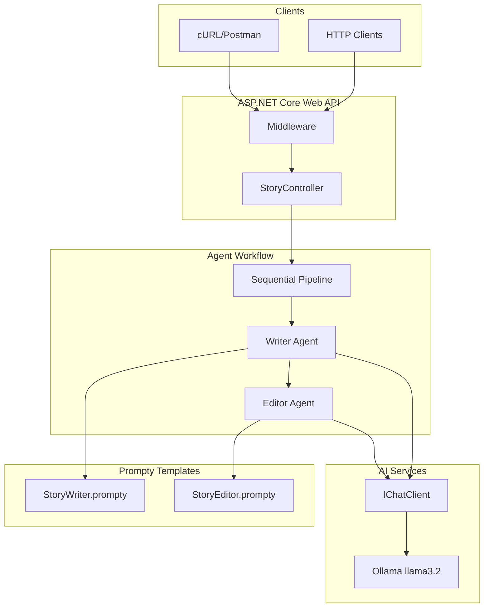
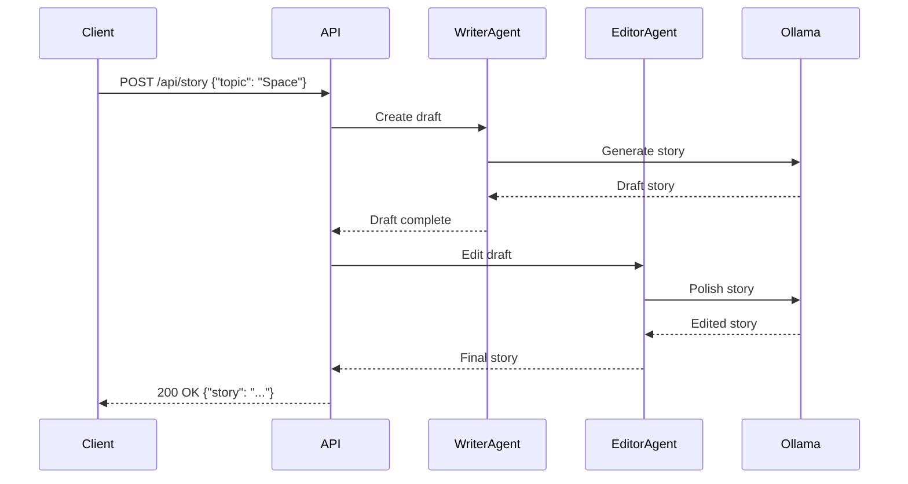
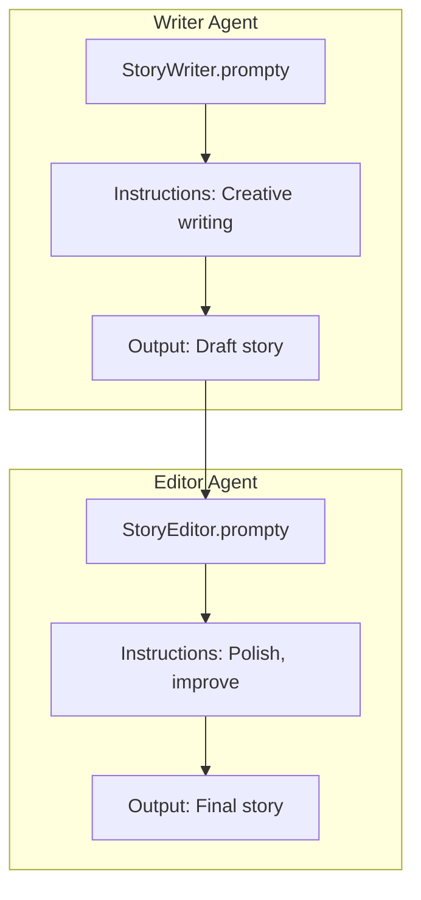

# AI.Workshop.WebApi.Agents

ASP.NET Core Web API demonstrating agent workflows with REST endpoints.

## Architecture



## Request Flow



## Endpoints

### POST /api/story

```mermaid
graph LR
    subgraph "Request"
        REQ[POST /api/story]
        BODY[{"topic": "string"}]
    end
    
    subgraph "Processing"
        WRT[Writer Agent]
        EDT[Editor Agent]
    end
    
    subgraph "Response"
        RES[{"story": "...", "draft": "..."}]
    end
    
    REQ --> BODY --> WRT --> EDT --> RES
```

**Request:**
```json
{
  "topic": "A journey to Mars"
}
```

**Response:**
```json
{
  "topic": "A journey to Mars",
  "draft": "Initial story draft...",
  "story": "Polished final story...",
  "writerTokens": 450,
  "editorTokens": 320
}
```

## Agent Pipeline



## Project Structure

```
AI.Workshop.WebApi.Agents/
├── Program.cs              # Entry point + DI
├── Controllers/
│   └── StoryController.cs  # REST endpoints
├── Services/
│   ├── WriterAgent.cs
│   └── EditorAgent.cs
├── Models/
│   ├── StoryRequest.cs
│   └── StoryResponse.cs
└── Prompts/
    ├── StoryWriter.prompty
    └── StoryEditor.prompty
```

## Configuration

```json
{
  "AI": {
    "OllamaUri": "http://localhost:11434/",
    "ChatModel": "llama3.2"
  }
}
```

## Technologies

| Technology | Version | Purpose |
|------------|---------|---------|
| .NET | 10.0 | Runtime |
| ASP.NET Core | 10.0 | Web API framework |
| Microsoft.Extensions.AI | 10.0.1 | AI abstractions |
| Ollama | - | LLM backend |
| Prompty.Core | 0.2.3 | Prompt templates |
| Swashbuckle | - | OpenAPI/Swagger |

## Usage

```bash
cd AI.Workshop.WebApi.Agents
dotnet run
```

**Swagger UI:** `https://localhost:5001/swagger`

**cURL Example:**
```bash
curl -X POST https://localhost:5001/api/story \
  -H "Content-Type: application/json" \
  -d '{"topic": "A robot learning to paint"}'
```

## OpenAPI Spec

```yaml
openapi: 3.0.1
paths:
  /api/story:
    post:
      summary: Generate a story using Writer and Editor agents
      requestBody:
        content:
          application/json:
            schema:
              type: object
              properties:
                topic:
                  type: string
      responses:
        200:
          description: Story generated successfully
          content:
            application/json:
              schema:
                type: object
                properties:
                  topic: { type: string }
                  draft: { type: string }
                  story: { type: string }
```
